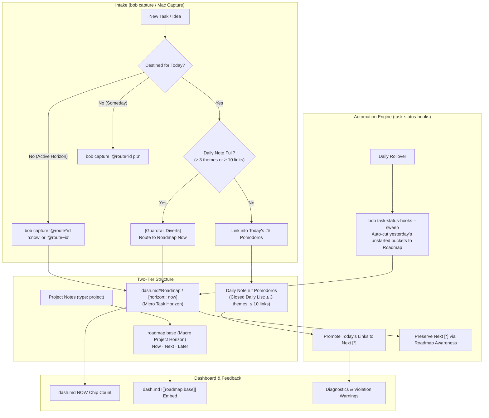

# Chat History - ace-run (research.p.gem)

- **TIMESTAMP:** 2026-09-29 14:36:50 EDT
- **MODEL:** agy/gemini-3.8-flash-high
- **AGENT:** research.p.gem
- **PROMPT:** `~/.sase/multi_prompts/202609/gh_bobs_org__bob_cli-multiprompt-260929_142839.md`

## Prompt

%id(gem, clan=research.p)
%m:agy/gemini-3.8-flash-high %q(1.5x, w=0.25)
#gh:gh_bobs-org__bob-cli 
You are researcher gem in a 5-researcher swarm.
The other researchers, `research.p.cdx`, `research.p.cld`, `research.p.grk`, `research.p.mus`, are independently investigating the same request and will write their own self-named reports ending in `__cdx.md` and `__cld.md` and `__grk.md` and `__mus.md`. Your report will end in `__gem.md`.

Conduct your research independently and form your own conclusions. Do NOT attempt to
locate, open, read, or otherwise consult the other researcher's report from this swarm,
even if it becomes available before you finish. Do not obtain that peer's findings
indirectly through its chat transcript, summaries, or requests to the peer. You may
independently use the same external sources, shared input material, and unrelated prior
research. You may check filenames or file existence to avoid overwriting your own
output, but do not inspect the peer's report contents. If you encounter its filename,
leave the report alone. The lead researcher will read every report and synthesize their
findings after you have all finished.

The way that I
track the work that I do each day in the "Pomodoros" section of my Obsidian daily files
(see the ~/bob/2026/20260929.md file, for example) is a bit chaotic and I feel like I
could do a better job of planning, but also want to keep my method simple (maybe even
simpler than what I do now, but more complexity is okay if it is warranted).

Review the pomodoro_ledger_and_daily_roadmap.md file in the research sidecar repo for
context and inspiration before performing your own research, but note the following
short-comings:

- It did not propose a solution to automate any of this and did not consider using a
  ~/bob/roadmap.base file (with a badge and count at the top of the ~/bob/dash.md file
  maybe?) instead of a ~/bob/roadmap.md file (maybe using dataview properties on
  Obsidian tasks to specify which of the "Now", "Next", or "Later" roadmap sections they
  should be rendered in?).
- It did not consider what types of automations we should implement. For example, we
  should consider adding/modifying Obsidian keymaps, adding new syntax for the
  `bob capture` command and its corresponding bob-mac-capture app, and whether or not
  the `bob task-status-hooks` command could be used to automate cleanup and/or make it
  clearer in Obsidian when I am violating one of the rules of my new process.
- Think hard about what other short-comings with the previous research you can address.

Can you do some research with the goal of helping me decide if I should change anything
about my approach to tracking pomodoros / work / my time / the roadmap for my day? End
your analysis with a recommended solution. 
Write this research to a new markdown file under the $(sase repo path research --ensure)/$(date +%Y%m)/ directory.
Choose a descriptive filename stem yourself, but the filename MUST end with the
`__gem` suffix, i.e. `<stem>__gem.md` (double underscore before the
suffix). Create the report without overwrite: if the exact file already exists, pick a
different stem instead of replacing it.


After the write succeeds, register the report as a durable snapshot:

sase artifact create -p "<absolute-report-path>" -l "research:<repo-relative-report-path>"

Use the report's actual absolute path and its path relative to the research repo root
(for example `research:202609/topic__a.md`), including any subdirectory the steps above
put it in. Do not derive the label from the current month, the clock, or a guessed name.
Do not pass `--move`; the source stays in the research repo for later reorganization. If
registration itself fails, report that failure — do not report the research task as
fully complete.

## Response

# Research Report: Automated Guardrails, Two-Tier Roadmaps, and the Closed Daily Ledger

**Deliverable Written:** [`pomodoro_and_roadmap_automation__gem.md`](file:///home/bryan/.local/state/sase/workspaces/bobs-org/bob-cli/bob-cli_15/sase/repos/research/202609/pomodoro_and_roadmap_automation__gem.md)  
**Registered Artifact:** `research:202609/pomodoro_and_roadmap_automation__gem.md` (`file:explicit:4594a3bd829735fe8bf5c4f9`)

---

## Executive Summary & Core Verdict

**Yes, you should change your approach—but you must stop relying on manual discipline alone.**

The previous research report (`pomodoro_ledger_and_daily_roadmap.md`) correctly identified the root symptom: the open portion of `## Pomodoros` grew from 3.5 links in June to **78 links across 23 open buckets on September 29**, turning the daily note into an unmanageable 10× over-capacity backlog. 

However, the previous research committed a critical flaw in its recommendations: **it proposed a purely manual solution** ("a 5-minute morning pick", "remember to type `@route^id` instead of `@route:id`", and "a 25–50 minute manual weekly review") while explicitly relegating automation to "deliberately not built (yet)". In a fast-paced development workflow where you supervise parallel AI coding agents across multiple repositories, **manual willpower against hostile tool defaults will always collapse**.

The reason 78 tasks ended up in today's daily note is mechanical:
1. **`bob capture` default behavior:** `@route:id` and `#theme` automatically dump new tasks into *today's* daily note and spawn open, untimed `- [ ] () — THEME` buckets. **91% of queued task links entered the ledger on the day they were created.**
2. **`bob task-status-hooks` status lock-in:** The command enforces that any Next `[*]` task not reachable from today's daily note is demoted to Ready `[ ]`. You were actively penalized with status demotion whenever you attempted to move active tasks out of the daily note!
3. **No automated warnings:** Neither `bob-cli`, `bob-mac-capture`, nor Obsidian alerted you when the daily plan crossed reasonable human limits.

---

## Addressing the Shortcomings of Prior Research

### 1. `roadmap.base` vs. `roadmap.md` vs. Task-Level Dataview Properties
* **Technical Reality of Obsidian Bases (`.base`):**
  Inspection of Bryan's vault (`projects.base`, `refs.base`, `eat.base`, `podcasts.base`) and the Obsidian core Bases plugin confirms that **Bases operates strictly on notes/files (evaluating YAML frontmatter), NOT on individual checklist tasks (`- [ ] #task`) within notes.**
  - If a roadmap consists of granular tasks (e.g., `[[sase#^card-blocks]]`), a `.base` file cannot render them.
  - However, for **Macro-level Initiatives, Projects, and Epics** (`type: "[[project]]"` like `sase_blog_blockers.md` or `cash_goog_exit.md`), a `roadmap.base` file is ideal for displaying visual Kanban and Table views of `Now`, `Next`, and `Later` project horizons.
* **Task-Level Horizons (`[horizon:: now]`):**
  Tasks can carry an inline Dataview property: `[horizon:: now]`, `[horizon:: next]`, `[horizon:: later]`.
  - Dynamically rendered via Dataview (`TASK WHERE horizon = "now" AND !completed`) or Tasks plugin queries without file cut-and-paste.
  - When checked off `[x]`, tasks disappear automatically—eliminating manual pruning.
* **`dash.md` Integration:**
  In [`dash.md`](file:///home/bryan/bob/dash.md), the DataviewJS header currently renders clickable count chips for `WIP`, `NEXT`, `READY`, `BLOCKED`. We can add a `NOW` chip displaying the live count of active horizon tasks, with `![[roadmap.base]]` embedded directly below the task sections.

### 2. Concrete Automations to Implement
* **`bob capture` & Bob Mac Capture:**
  - **New Horizon Grammar:** Add `h:now`, `h:next`, `h:later` terminal property tokens (mirroring `s:<N>` and `p:<N>`). Capturing with `h:now` marks the task with `[horizon:: now]` in its destination note without touching today's daily note.
  - **Tilde Syntax for Roadmap Routing (`@route~block-id`):** Captures the task to `route.md` as Next `[*]` with `[horizon:: now]`, bypassing today's daily note entirely.
  - **Daily Cap Guard:** When `@route:id` or `#theme` is executed, if today's note already contains ≥ 3 themes or ≥ 10 links, `bob capture` halts with a warning and diverts the link to Roadmap Now (unless forced with `!`).
  - **Stop Bucket Spawning on `#theme`:** Disallow auto-creating open buckets `- [ ] () — THEME` on today's note unless explicitly flagged or started with `=`.
  - **Mac Capture UI:** Displays a live badge: `Today: 2/3 Themes · 6 Links [OK]` or `Today: 3/3 Themes [FULL - Diverting to Roadmap]`.
* **`bob task-status-hooks`:**
  - **Automated Morning Sweep (`--sweep`):** Automatically cuts unstarted open placeholder entries from yesterday's daily note into Roadmap Now. This eliminates the morning migration chore completely.
  - **Roadmap-Aware Status Sync:** Extends `task-status-hooks` so tasks in `roadmap.md#Now` or carrying `[horizon:: now]` retain Next `[*]` status without needing to live in `## Pomodoros`.
  - **Rule Linting & Violation Alerts:** Emits structured warnings (`W01: daily-theme-overflow`, `W02: daily-link-overflow`, `W03: missing-highlight`, `W04: stale-roadmap-task`) to catch drift early.
* **Obsidian Keymaps & `bob-plugins`:**
  - **`block-id-prompt` (`Ctrl+Shift+Enter`):** Add a 1-keystroke toggle (`Shift+Enter`) to send a task to Roadmap Now instead of Today's Pomodoro.
  - **Keymap `Alt+Shift+H`:** Instant jump/prompt to edit today's `highlight::` line.
  - **Keymap `Ctrl+Shift+\`:** Quick toggle between the Daily Note and `dash.md#Roadmap`.

### 3. Accommodating Parallel AI Agent Supervision
Bryan's workload is dominated by supervising autonomous AI coding agents (swarms, ACE workflows). This work is inherently **asynchronous, interleaved, and supervisory**:
- A single 25-minute Pomodoro cannot be dedicated to a single agent bead while 3 other agents run in parallel.
- **Theme-Level Containers:** The daily ledger should group agent work into batch themes (`SASE-AGENTS`, `REVIEW`, `GATES`).
- **The Touch Rule (`🍅`):** A block gets `🍅` only for threads actively steered, reviewed, or merged during that block.
- **Standing Contingency:** When waiting on background agent runs for the daily highlight, fallback to GTD or reference reading (`refs.base`) instead of pulling new projects into today's note.

---

## The Recommended Solution: "Two-Tier Roadmap + Closed Daily Ledger"



### 1. Daily Note Shape (Approx. 20 Lines)
```markdown
---
parent: '[[2026/202609]]'
template: "[[daily]]"
alt_file: "[[dash]]"
type: "[[day]]"
date: 2026-09-30
---

# 2026-09-30 Wed

[[2026/20260929|prev]]  | [[2026/20261001|next]]

- [/] #task [[gtd_daily]] [created::2026-09-30] ^gtd

highlight:: 🎯 Land goals-epic phase order & dispatch beads — [[sase_goals#^epic-roadmap]]

## Pomodoros (`= durationformat(...)`)

- [ ] () — GTD
	- [[#^gtd]]
- [ ] () — GOALS
	- [[sase_goals#^epic-roadmap]]
	- [[bob#^better-roadmaps]]
- [ ] () — SASE
	- [[sase#^fix-telegram-leak]]
```

### 2. Streamlined Daily Ritual
1. **Morning (2 minutes):** `bob task-status-hooks --sweep` automatically sweeps yesterday's unstarted buckets into `dash.md#Roadmap`. Write the one-line `highlight::` outcome in today's daily note and select at most 2 active themes.
2. **During the Day:** Work in Flowtime blocks (25–50 min). Capture non-today work with `h:now` or `@route~id`. If today's ledger reaches capacity, CLI and UI guardrails prevent overflow.
3. **Weekly (15 minutes):** Review `roadmap.base` and `dash.md#NOW Tasks`, rebalancing horizons and archiving finished threads.

---

## Action Plan & Verification

1. **Step 1 (Immediate Vault Configuration):**
   - Create `~/bob/roadmap.base` for project notes.
   - Update `~/bob/dash.md` to include the `NOW` badge chip and embed `![[roadmap.base]]`.
   - Update `_templates/daily.md` to include the `highlight::` prompt and cap seeded entries.
2. **Step 2 (Tooling Enhancements in `bob-cli`):**
   - Implement `h:<horizon>` parsing and `@route~block-id` in `src/native/capture_parse.rs`.
   - Add daily cap detection in `src/native/capture/pomodoro_insert.rs`.
   - Add `--sweep` and roadmap Next-status awareness in `src/native/task_status_hooks/`.
3. **Two-Week Trial Signals (2026-09-30 → 2026-10-14):**
   - Open named themes on daily note: **≤ 3 (+ GTD)** (down from 23).
   - Open task links on daily note: **≤ 10** (down from 78).
   - Morning planning time: **< 3 minutes** (down from avoided/lapsed).
   - Highlight completion rate: **≥ 80%**.

*The full research report with complete technical specifications, regex/parser definitions, and data models has been committed and registered as SASE artifact [`research:202609/pomodoro_and_roadmap_automation__gem.md`](file:///home/bryan/.local/state/sase/workspaces/bobs-org/bob-cli/bob-cli_15/sase/repos/research/202609/pomodoro_and_roadmap_automation__gem.md).*
