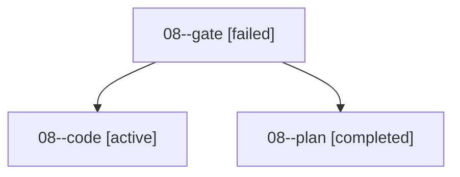

# Family: 08

[Agent Hoods](../README.md) / [bbugyi200](../users/bbugyi200/README.md) / [apollo](../users/bbugyi200/machines/apollo/README.md) / [08](../users/bbugyi200/machines/apollo/hoods/08/README.md) / 08

Owner: `bbugyi200.apollo` · Hood: `08` · Members: 3

## Lineage

The diagram is an optional enhancement; the ordered table below contains the same lineage in accessible text.

| Role | Agent | State | Model / provider | Timing | Commits | Prompt | Chat |
|---|---|---|---|---|---:|---|---|
| gate | 08--gate | failed | gpt-6-astra / codex | 2026-09-17T13:53:38.723086+00:00 → 2026-09-17T13:53:49.579695+00:00 | 0 | — | [Chat](../agents/bbugyi200.apollo.08--gate/chat.md) |
| code | 08--code | active | gpt-5.5 / codex | 2026-09-17T13:53:53.694920+00:00 | [1](../agents/bbugyi200.apollo.08--code/README.md#commits) | [Prompt](../agents/bbugyi200.apollo.08--code/prompt.md) | — |
| plan | 08--plan | completed | gpt-6-astra / codex | 2026-09-17T13:45:21.282398+00:00 → 2026-09-17T13:53:37.655983+00:00 | 0 | [Prompt](../agents/bbugyi200.apollo.08--plan/prompt.md) | [Chat](../agents/bbugyi200.apollo.08--plan/chat.md) |

## Commits

| Role | Repo | Commit | Subject | Committed |
|---|---|---|---|---|
| code | bob-cli | [`f4ca95b`](https://github.com/bobs-org/bob-cli/commit/f4ca95b2b92302cd268ac544fdfff61019c09706) | docs(highlights): document parallel xlib pull | 2026-09-17 10:07:43 EDT |
