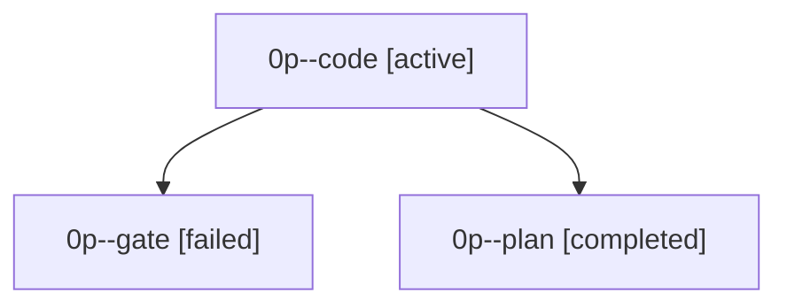

# Family: 0p

[Agent Hoods](../README.md) / [bbugyi200](../users/bbugyi200/README.md) / [apollo](../users/bbugyi200/machines/apollo/README.md) / [0p](../users/bbugyi200/machines/apollo/hoods/0p/README.md) / 0p

Owner: `bbugyi200.apollo` · Hood: `0p` · Members: 3

## Lineage

The diagram is an optional enhancement; the ordered table below contains the same lineage in accessible text.

| Role | Agent | State | Model / provider | Timing | Commits | Prompt | Chat |
|---|---|---|---|---|---:|---|---|
| code | 0p--code | active | grok-4.6 / grok | 2026-09-19T13:13:53.407117+00:00 | 0 | [Prompt](../agents/bbugyi200.apollo.0p--code/prompt.md) | — |
| gate | 0p--gate | failed | grok-4.6 / grok | 2026-09-19T13:13:34.073756+00:00 → 2026-09-19T13:13:48.297948+00:00 | 0 | — | [Chat](../agents/bbugyi200.apollo.0p--gate/chat.md) |
| plan | 0p--plan | completed | grok-4.6 / grok | 2026-09-19T13:04:36.653067+00:00 → 2026-09-19T13:13:37.285775+00:00 | 0 | [Prompt](../agents/bbugyi200.apollo.0p--plan/prompt.md) | [Chat](../agents/bbugyi200.apollo.0p--plan/chat.md) |
