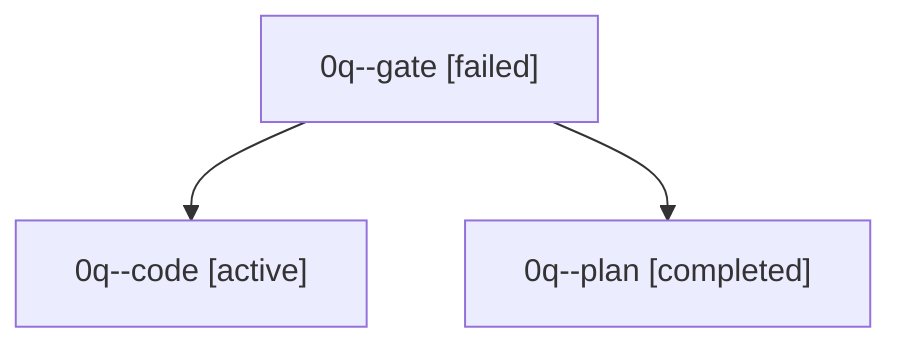

# Family: 0q

[Agent Hoods](../README.md) / [bbugyi200](../users/bbugyi200/README.md) / [apollo](../users/bbugyi200/machines/apollo/README.md) / [0q](../users/bbugyi200/machines/apollo/hoods/0q/README.md) / 0q

Owner: `bbugyi200.apollo` · Hood: `0q` · Members: 3

## Lineage

The diagram is an optional enhancement; the ordered table below contains the same lineage in accessible text.

| Role | Agent | State | Model / provider | Timing | Commits | Prompt | Chat |
|---|---|---|---|---|---:|---|---|
| gate | 0q--gate | failed | grok-4.6 / grok | 2026-09-19T13:25:06.811125+00:00 → 2026-09-19T13:25:20.776379+00:00 | 0 | — | [Chat](../agents/bbugyi200.apollo.0q--gate/chat.md) |
| code | 0q--code | active | grok-4.6 / grok | 2026-09-19T13:25:26.391061+00:00 | 0 | [Prompt](../agents/bbugyi200.apollo.0q--code/prompt.md) | — |
| plan | 0q--plan | completed | grok-4.6 / grok | 2026-09-19T13:12:43.755102+00:00 → 2026-09-19T13:24:52.345026+00:00 | 0 | [Prompt](../agents/bbugyi200.apollo.0q--plan/prompt.md) | [Chat](../agents/bbugyi200.apollo.0q--plan/chat.md) |
