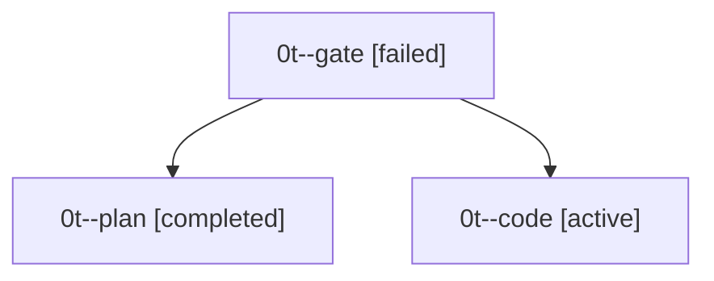

# Family: 0t

[Agent Hoods](../README.md) / [bbugyi200](../users/bbugyi200/README.md) / [apollo](../users/bbugyi200/machines/apollo/README.md) / [0t](../users/bbugyi200/machines/apollo/hoods/0t/README.md) / 0t

Owner: `bbugyi200.apollo` · Hood: `0t` · Members: 3

## Lineage

The diagram is an optional enhancement; the ordered table below contains the same lineage in accessible text.

| Role | Agent | State | Model / provider | Timing | Commits | Prompt | Chat |
|---|---|---|---|---|---:|---|---|
| gate | 0t--gate | failed | gpt-5.6-sol / codex | 2026-09-19T17:18:32.352062+00:00 → 2026-09-19T17:18:51.065348+00:00 | 0 | — | [Chat](../agents/bbugyi200.apollo.0t--gate/chat.md) |
| plan | 0t--plan | completed | gpt-5.6-sol / codex | 2026-09-19T17:12:32.296854+00:00 → 2026-09-19T17:18:18.395871+00:00 | 0 | [Prompt](../agents/bbugyi200.apollo.0t--plan/prompt.md) | [Chat](../agents/bbugyi200.apollo.0t--plan/chat.md) |
| code | 0t--code | active | sonnet / claude | 2026-09-19T17:18:56.090210+00:00 | 0 | [Prompt](../agents/bbugyi200.apollo.0t--code/prompt.md) | — |
