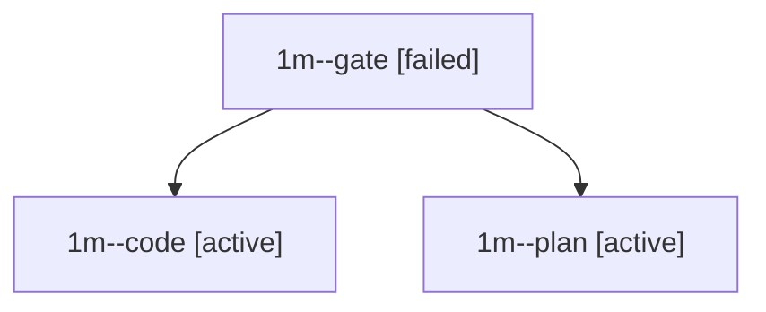

# Family: 1m

[Agent Hoods](../README.md) / [bbugyi200](../users/bbugyi200/README.md) / [apollo](../users/bbugyi200/machines/apollo/README.md) / [1m](../users/bbugyi200/machines/apollo/hoods/1m/README.md) / 1m

Owner: `bbugyi200.apollo` · Hood: `1m` · Members: 3

## Lineage

The diagram is an optional enhancement; the ordered table below contains the same lineage in accessible text.

| Role | Agent | State | Model / provider | Timing | Commits | Prompt | Chat |
|---|---|---|---|---|---:|---|---|
| gate | 1m--gate | failed | opus / claude | 2026-09-24T22:19:48.530049+00:00 → 2026-09-24T22:19:57.052496+00:00 | 0 | — | [Chat](../agents/bbugyi200.apollo.1m--gate/chat.md) |
| code | 1m--code | active | sonnet / claude | 2026-09-24T22:20:04.413944+00:00 | 0 | — | — |
| plan | 1m--plan | active | opus / claude | 2026-09-24T22:14:17.111358+00:00 | 0 | [Prompt](../agents/bbugyi200.apollo.1m--plan/prompt.md) | [Chat](../agents/bbugyi200.apollo.1m--plan/chat.md) |

## Commits

| Role | Repo | Commit | Subject | Committed |
|---|---|---|---|---|
| — | bob-cli | [`aedab17`](https://github.com/bobs-org/bob-cli/commit/aedab175d90f3323fbd2a237dcdf22a0f25ae84d) | chore: Add SDD prompt and plan for highlights\_ref\_marker\_pdfdoc\_newlines | 2026-06-03 08:57:34 EDT |
| — | bob-cli | [`04d7b5a`](https://github.com/bobs-org/bob-cli/commit/04d7b5af72e17560162f02c2e66cce73c8327a8e) | fix: preserve literal PDF marker newlines | 2026-06-03 09:02:27 EDT |
