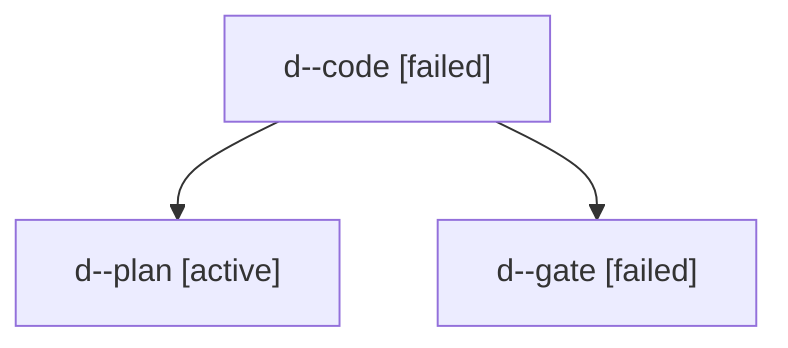

# Family: d

[Agent Hoods](../README.md) / [bbugyi200](../users/bbugyi200/README.md) / [apollo](../users/bbugyi200/machines/apollo/README.md) / [d](../users/bbugyi200/machines/apollo/hoods/d/README.md) / d

Owner: `bbugyi200.apollo` · Hood: `d` · Members: 3

## Lineage

The diagram is an optional enhancement; the ordered table below contains the same lineage in accessible text.

| Role | Agent | State | Model / provider | Timing | Commits | Prompt | Chat |
|---|---|---|---|---|---:|---|---|
| code | d--code | failed | gpt-5.5 / codex | 2026-09-03T20:20:29.748019+00:00 → 2026-09-03T20:34:15.081201+00:00 | [1](../agents/bbugyi200.apollo.d--code/README.md#commits) | [Prompt](../agents/bbugyi200.apollo.d--code/prompt.md) | — |
| plan | d--plan | active | opus / claude | 2026-09-03T20:07:54.563753+00:00 | 0 | [Prompt](../agents/bbugyi200.apollo.d--plan/prompt.md) | [Chat](../agents/bbugyi200.apollo.d--plan/chat.md) |
| gate | d--gate | failed | opus / claude | 2026-09-03T20:16:20.585026+00:00 → 2026-09-03T20:19:15.613681+00:00 | 0 | — | [Chat](../agents/bbugyi200.apollo.d--gate/chat.md) |

## Commits

| Role | Repo | Commit | Subject | Committed |
|---|---|---|---|---|
| code | bob-cli | [`92dfd5e`](https://github.com/bobs-org/bob-cli/commit/92dfd5ebdecaca002be4dbc78dd163063ca4e559) | docs(highlights): document Apollo xlib source candidates | 2026-09-03 16:24:23 EDT |
