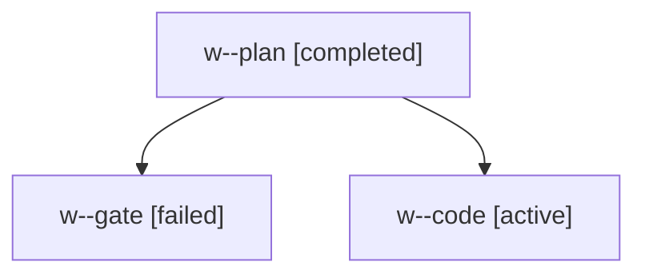

# Family: w

[Agent Hoods](../README.md) / [bbugyi200](../users/bbugyi200/README.md) / [apollo](../users/bbugyi200/machines/apollo/README.md) / [w](../users/bbugyi200/machines/apollo/hoods/w/README.md) / w

Owner: `bbugyi200.apollo` · Hood: `w` · Members: 3

## Lineage

The diagram is an optional enhancement; the ordered table below contains the same lineage in accessible text.

| Role | Agent | State | Model / provider | Timing | Commits | Prompt | Chat |
|---|---|---|---|---|---:|---|---|
| plan | w--plan | completed | opus / claude | 2026-09-13T22:27:14.747438+00:00 → 2026-09-13T22:40:23.958258+00:00 | 0 | [Prompt](../agents/bbugyi200.apollo.w--plan/prompt.md) | [Chat](../agents/bbugyi200.apollo.w--plan/chat.md) |
| gate | w--gate | failed | opus / claude | 2026-09-13T22:42:09.079091+00:00 → 2026-09-13T23:16:27.169617+00:00 | 0 | — | [Chat](../agents/bbugyi200.apollo.w--gate/chat.md) |
| code | w--code | active | sonnet / claude | 2026-09-13T23:16:31.766967+00:00 | 0 | [Prompt](../agents/bbugyi200.apollo.w--code/prompt.md) | — |
