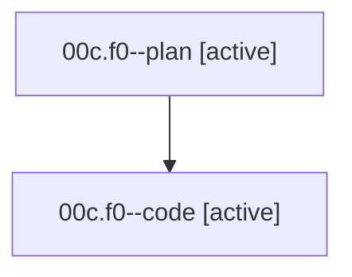

# Family: 00c.f0

[Agent Hoods](../README.md) / [bbugyi200](../users/bbugyi200/README.md) / [athena](../users/bbugyi200/machines/athena/README.md) / [00c](../users/bbugyi200/machines/athena/hoods/00c/README.md) / 00c.f0

Owner: `bbugyi200.athena` · Hood: `00c` · Members: 2

## Lineage

The diagram is an optional enhancement; the ordered table below contains the same lineage in accessible text.

| Role | Agent | State | Model / provider | Timing | Commits | Prompt | Chat |
|---|---|---|---|---|---:|---|---|
| plan | 00c.f0--plan | active | opus / claude | 2026-08-14T11:07:40.164359+00:00 | 0 | [Prompt](../agents/bbugyi200.athena.00c.f0--plan/prompt.md) | [Chat](../agents/bbugyi200.athena.00c.f0--plan/chat.md) |
| code | 00c.f0--code | active | gpt-5.5 / codex | 2026-08-14T11:11:26.143719+00:00 | 0 | — | — |

## Neighbors

| Agent | Relation | State |
|---|---|---|
| [00c](../agents/bbugyi200.athena.00c/README.md) | ancestor | completed |
