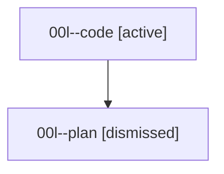

# Family: 00l

[Agent Hoods](../README.md) / [bbugyi200](../users/bbugyi200/README.md) / [athena](../users/bbugyi200/machines/athena/README.md) / [00l](../users/bbugyi200/machines/athena/hoods/00l/README.md) / 00l

Owner: `bbugyi200.athena` · Hood: `00l` · Members: 2

## Lineage

The diagram is an optional enhancement; the ordered table below contains the same lineage in accessible text.

| Role | Agent | State | Model / provider | Timing | Commits | Prompt | Chat |
|---|---|---|---|---|---:|---|---|
| code | 00l--code | active | gpt-5.5 / codex | 2026-08-14T11:50:59.345280+00:00 | 0 | — | — |
| plan | 00l--plan | dismissed | opus / claude | 2026-08-14T07:46:07.254997 → 2026-08-14T07:51:01.654467 | 0 | — | — |
