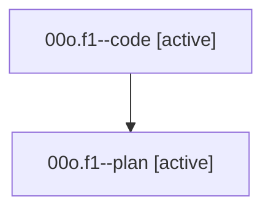

# Family: 00o.f1

[Agent Hoods](../README.md) / [bbugyi200](../users/bbugyi200/README.md) / [athena](../users/bbugyi200/machines/athena/README.md) / [00o](../users/bbugyi200/machines/athena/hoods/00o/README.md) / 00o.f1

Owner: `bbugyi200.athena` · Hood: `00o` · Members: 2

## Lineage

The diagram is an optional enhancement; the ordered table below contains the same lineage in accessible text.

| Role | Agent | State | Model / provider | Timing | Commits | Prompt | Chat |
|---|---|---|---|---|---:|---|---|
| code | 00o.f1--code | active | sonnet / claude | 2026-08-14T12:37:59.551734+00:00 | 0 | — | — |
| plan | 00o.f1--plan | active | opus / claude | 2026-08-14T12:23:06.026162+00:00 | 0 | [Prompt](../agents/bbugyi200.athena.00o.f1--plan/prompt.md) | [Chat](../agents/bbugyi200.athena.00o.f1--plan/chat.md) |

## Neighbors

| Agent | Relation | State |
|---|---|---|
| [00o](../agents/bbugyi200.athena.00o/README.md) | ancestor | completed |
| [00o.f0](bbugyi200.athena.00o.f0.md) (family · 2) | 00o hood | completed 2 |
