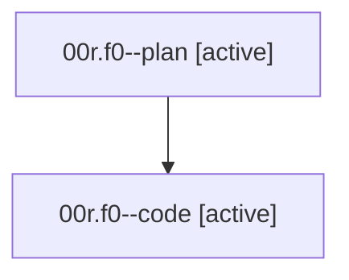

# Family: 00r.f0

[Agent Hoods](../README.md) / [bbugyi200](../users/bbugyi200/README.md) / [athena](../users/bbugyi200/machines/athena/README.md) / [00r](../users/bbugyi200/machines/athena/hoods/00r/README.md) / 00r.f0

Owner: `bbugyi200.athena` · Hood: `00r` · Members: 2

## Lineage

The diagram is an optional enhancement; the ordered table below contains the same lineage in accessible text.

| Role | Agent | State | Model / provider | Timing | Commits | Prompt | Chat |
|---|---|---|---|---|---:|---|---|
| plan | 00r.f0--plan | active | gpt-5.6-sol / codex | 2026-08-14T12:42:50.958015+00:00 | 0 | [Prompt](../agents/bbugyi200.athena.00r.f0--plan/prompt.md) | [Chat](../agents/bbugyi200.athena.00r.f0--plan/chat.md) |
| code | 00r.f0--code | active | gpt-5.5 / codex | 2026-08-14T12:46:26.974537+00:00 | 0 | — | — |

## Neighbors

| Agent | Relation | State |
|---|---|---|
| [00r](bbugyi200.athena.00r.md) (family · 2) | ancestor | completed 2 |
