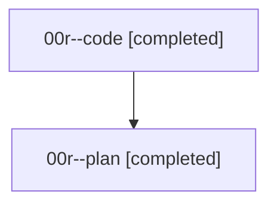

# Family: 00r

[Agent Hoods](../README.md) / [bbugyi200](../users/bbugyi200/README.md) / [athena](../users/bbugyi200/machines/athena/README.md) / [00r](../users/bbugyi200/machines/athena/hoods/00r/README.md) / 00r

Owner: `bbugyi200.athena` · Hood: `00r` · Members: 2

## Lineage

The diagram is an optional enhancement; the ordered table below contains the same lineage in accessible text.

| Role | Agent | State | Model / provider | Timing | Commits | Prompt | Chat |
|---|---|---|---|---|---:|---|---|
| code | 00r--code | completed | sonnet / claude | 2026-08-14T12:37:41.932898+00:00 | 0 | — | [Chat](../agents/bbugyi200.athena.00r--code/chat.md) |
| plan | 00r--plan | completed | gpt-5.6-sol / codex | 2026-08-14T12:31:49.415258+00:00 | 0 | [Prompt](../agents/bbugyi200.athena.00r--plan/prompt.md) | [Chat](../agents/bbugyi200.athena.00r--plan/chat.md) |

## Neighbors

| Agent | Relation | State |
|---|---|---|
| [00r.f0](bbugyi200.athena.00r.f0.md) (family · 2) | descendant | active 2 |
