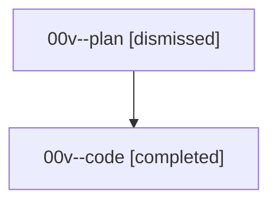

# Family: 00v

[Agent Hoods](../README.md) / [bbugyi200](../users/bbugyi200/README.md) / [athena](../users/bbugyi200/machines/athena/README.md) / [00v](../users/bbugyi200/machines/athena/hoods/00v/README.md) / 00v

Owner: `bbugyi200.athena` · Hood: `00v` · Members: 2

## Lineage

The diagram is an optional enhancement; the ordered table below contains the same lineage in accessible text.

| Role | Agent | State | Model / provider | Timing | Commits | Prompt | Chat |
|---|---|---|---|---|---:|---|---|
| plan | 00v--plan | dismissed | opus / claude | 2026-08-14T08:57:55.549691 → 2026-08-14T09:07:23.209885 | 0 | — | [Chat](../agents/bbugyi200.athena.00v--plan/chat.md) |
| code | 00v--code | completed | sonnet / claude | 2026-08-14T13:03:41.969494+00:00 | 0 | — | [Chat](../agents/bbugyi200.athena.00v--code/chat.md) |

## Commits

| Role | Repo | Commit | Subject | Committed |
|---|---|---|---|---|
| — | bob-cli | [`606fb69`](https://github.com/bobs-org/bob-cli/commit/606fb69ae892f487bbba0e9eb2b84f7a8bf4eed6) | chore: Add SDD prompt and plan for obsidian\_task\_toggle\_next\_section | 2026-06-19 07:51:30 EDT |
| — | bob-cli | [`6ee6797`](https://github.com/bobs-org/bob-cli/commit/6ee6797952a3653764bda04b4bcd6b1c71c54a7f) | chore: Mark SDD plan done | 2026-06-19 08:11:25 EDT |

## Neighbors

| Agent | Relation | State |
|---|---|---|
| [00v.f1](../agents/bbugyi200.athena.00v.f1/README.md) | descendant | completed |
