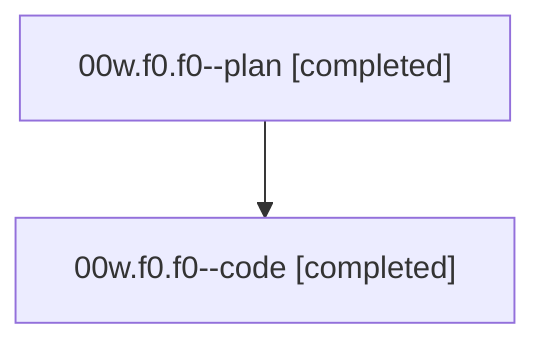

# Family: 00w.f0.f0

[Agent Hoods](../README.md) / [bbugyi200](../users/bbugyi200/README.md) / [athena](../users/bbugyi200/machines/athena/README.md) / [00w](../users/bbugyi200/machines/athena/hoods/00w/README.md) / 00w.f0.f0

Owner: `bbugyi200.athena` · Hood: `00w` · Members: 2

## Lineage

The diagram is an optional enhancement; the ordered table below contains the same lineage in accessible text.

| Role | Agent | State | Model / provider | Timing | Commits | Prompt | Chat |
|---|---|---|---|---|---:|---|---|
| plan | 00w.f0.f0--plan | completed | gpt-5.6-sol / codex | 2026-08-14T14:10:37.409355+00:00 | 0 | [Prompt](../agents/bbugyi200.athena.00w.f0.f0--plan/prompt.md) | [Chat](../agents/bbugyi200.athena.00w.f0.f0--plan/chat.md) |
| code | 00w.f0.f0--code | completed | gpt-5.5 / codex | 2026-08-14T14:18:35.118086+00:00 | 0 | — | [Chat](../agents/bbugyi200.athena.00w.f0.f0--code/chat.md) |

## Neighbors

| Agent | Relation | State |
|---|---|---|
| [00w.f0](bbugyi200.athena.00w.f0.md) (family · 2) | ancestor | completed 2 |
| [00w](../agents/bbugyi200.athena.00w/README.md) | ancestor | completed |
| [00w.f0.f0.w0](bbugyi200.athena.00w.f0.f0.w0.md) (family · 2) | descendant | failed 2 |
| [00w.f0.f0.w0.w0](bbugyi200.athena.00w.f0.f0.w0.w0.md) (family · 2) | descendant | failed 2 |
| [00w.f0.f0.w0.w0.w0](bbugyi200.athena.00w.f0.f0.w0.w0.w0.md) (family · 2) | descendant | completed 2 |
| [00w.f0.f0.w0.w0.w0.f0](bbugyi200.athena.00w.f0.f0.w0.w0.w0.f0.md) (family · 2) | descendant | active 2 |
