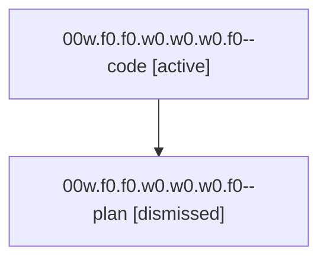

# Family: 00w.f0.f0.w0.w0.w0.f0

[Agent Hoods](../README.md) / [bbugyi200](../users/bbugyi200/README.md) / [athena](../users/bbugyi200/machines/athena/README.md) / [00w](../users/bbugyi200/machines/athena/hoods/00w/README.md) / 00w.f0.f0.w0.w0.w0.f0

Owner: `bbugyi200.athena` · Hood: `00w` · Members: 2

## Lineage

The diagram is an optional enhancement; the ordered table below contains the same lineage in accessible text.

| Role | Agent | State | Model / provider | Timing | Commits | Prompt | Chat |
|---|---|---|---|---|---:|---|---|
| code | 00w.f0.f0.w0.w0.w0.f0--code | active | sonnet / claude | 2026-08-14T15:33:22.097699+00:00 | 0 | — | — |
| plan | 00w.f0.f0.w0.w0.w0.f0--plan | dismissed | gpt-5.6-sol / codex | 2026-08-14T11:29:55.268199 → 2026-08-14T11:36:45.816547 | 0 | — | — |

## Neighbors

| Agent | Relation | State |
|---|---|---|
| [00w.f0.f0.w0.w0.w0](bbugyi200.athena.00w.f0.f0.w0.w0.w0.md) (family · 2) | ancestor | completed 1, dismissed 1 |
| [00w.f0.f0.w0.w0](bbugyi200.athena.00w.f0.f0.w0.w0.md) (family · 2) | ancestor | dismissed 1, failed 1 |
| [00w.f0.f0.w0](bbugyi200.athena.00w.f0.f0.w0.md) (family · 2) | ancestor | dismissed 1, failed 1 |
| [00w.f0.f0](bbugyi200.athena.00w.f0.f0.md) (family · 2) | ancestor | completed 1, dismissed 1 |
| [00w.f0](bbugyi200.athena.00w.f0.md) (family · 2) | ancestor | completed 1, dismissed 1 |
| [00w](../agents/bbugyi200.athena.00w/README.md) | ancestor | completed |
