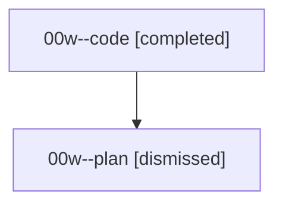

# Family: 00w

[Agent Hoods](../README.md) / [bbugyi200](../users/bbugyi200/README.md) / [athena](../users/bbugyi200/machines/athena/README.md) / [00w](../users/bbugyi200/machines/athena/hoods/00w/README.md) / 00w

Owner: `bbugyi200.athena` · Hood: `00w` · Members: 2

## Lineage

The diagram is an optional enhancement; the ordered table below contains the same lineage in accessible text.

| Role | Agent | State | Model / provider | Timing | Commits | Prompt | Chat |
|---|---|---|---|---|---:|---|---|
| code | 00w--code | completed | gpt-5.5 / codex | 2026-08-14T13:25:55.563545+00:00 | 0 | — | [Chat](../agents/bbugyi200.athena.00w--code/chat.md) |
| plan | 00w--plan | dismissed | gpt-5.6-sol / codex | 2026-08-14T09:07:29.655673 → 2026-08-14T09:44:24.525278 | 0 | — | [Chat](../agents/bbugyi200.athena.00w--plan/chat.md) |

## Commits

| Role | Repo | Commit | Subject | Committed |
|---|---|---|---|---|
| — | bob-cli | [`afab0c0`](https://github.com/bobs-org/bob-cli/commit/afab0c081a8bdfb1af37773a1a10602409623ad3) | chore: Add SDD prompt and plan for conditional\_pomodoro\_creation | 2026-06-19 11:52:51 UTC |
| — | bob-cli | [`3ef5f01`](https://github.com/bobs-org/bob-cli/commit/3ef5f0181eaed826534a79d4d02b9dabdaafa7b9) | chore: Mark SDD plan done | 2026-06-20 01:26:57 UTC |

## Neighbors

| Agent | Relation | State |
|---|---|---|
| [00w.f0](bbugyi200.athena.00w.f0.md) (family · 2) | descendant | completed 1, dismissed 1 |
| [00w.f0.f0](bbugyi200.athena.00w.f0.f0.md) (family · 2) | descendant | completed 1, dismissed 1 |
| [00w.f0.f0.w0](bbugyi200.athena.00w.f0.f0.w0.md) (family · 2) | descendant | dismissed 1, failed 1 |
| [00w.f0.f0.w0.w0](bbugyi200.athena.00w.f0.f0.w0.w0.md) (family · 2) | descendant | dismissed 1, failed 1 |
| [00w.f0.f0.w0.w0.w0](bbugyi200.athena.00w.f0.f0.w0.w0.w0.md) (family · 2) | descendant | completed 1, dismissed 1 |
| [00w.f0.f0.w0.w0.w0.f0](bbugyi200.athena.00w.f0.f0.w0.w0.w0.f0.md) (family · 2) | descendant | active 1, dismissed 1 |
