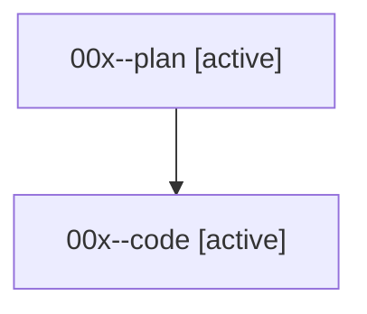

# Family: 00x

[Agent Hoods](../README.md) / [bbugyi200](../users/bbugyi200/README.md) / [athena](../users/bbugyi200/machines/athena/README.md) / [00x](../users/bbugyi200/machines/athena/hoods/00x/README.md) / 00x

Owner: `bbugyi200.athena` · Hood: `00x` · Members: 2

## Lineage

The diagram is an optional enhancement; the ordered table below contains the same lineage in accessible text.

| Role | Agent | State | Model / provider | Timing | Commits | Prompt | Chat |
|---|---|---|---|---|---:|---|---|
| plan | 00x--plan | active | opus / claude | 2026-08-14T13:12:55.433726+00:00 | 0 | [Prompt](../agents/bbugyi200.athena.00x--plan/prompt.md) | [Chat](../agents/bbugyi200.athena.00x--plan/chat.md) |
| code | 00x--code | active | sonnet / claude | 2026-08-14T13:22:25.216437+00:00 | 0 | — | — |
