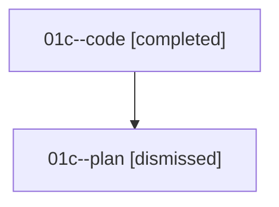

# Family: 01c

[Agent Hoods](../README.md) / [bbugyi200](../users/bbugyi200/README.md) / [athena](../users/bbugyi200/machines/athena/README.md) / [01c](../users/bbugyi200/machines/athena/hoods/01c/README.md) / 01c

Owner: `bbugyi200.athena` · Hood: `01c` · Members: 2

## Lineage

The diagram is an optional enhancement; the ordered table below contains the same lineage in accessible text.

| Role | Agent | State | Model / provider | Timing | Commits | Prompt | Chat |
|---|---|---|---|---|---:|---|---|
| code | 01c--code | completed | gpt-5.5 / codex | 2026-08-14T15:55:13.474656+00:00 | [1](../agents/bbugyi200.athena.01c--code/README.md#commits) | — | [Chat](../agents/bbugyi200.athena.01c--code/chat.md) |
| plan | 01c--plan | dismissed | opus / claude | 2026-08-14T11:45:42.474501 → 2026-08-14T12:11:43.683512 | 0 | — | [Chat](../agents/bbugyi200.athena.01c--plan/chat.md) |

## Commits

| Role | Repo | Commit | Subject | Committed |
|---|---|---|---|---|
| code | bob-cli | [`7fa0658`](https://github.com/bobs-org/bob-cli/commit/7fa06585b32cd15f136f7b5a0908fa05d0dc50b5) | fix(capture): always emit clip entries in JSON | 2026-08-14 12:08:09 EDT |
