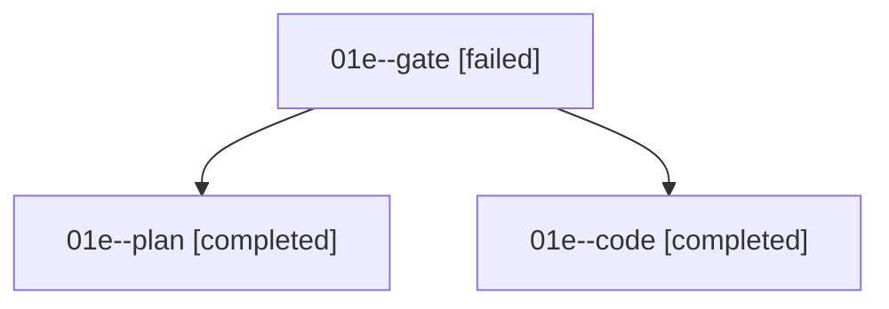

# Family: 01e

[Agent Hoods](../README.md) / [bbugyi200](../users/bbugyi200/README.md) / [athena](../users/bbugyi200/machines/athena/README.md) / [01e](../users/bbugyi200/machines/athena/hoods/01e/README.md) / 01e

Owner: `bbugyi200.athena` · Hood: `01e` · Members: 3

## Lineage

The diagram is an optional enhancement; the ordered table below contains the same lineage in accessible text.

| Role | Agent | State | Model / provider | Timing | Commits | Prompt | Chat |
|---|---|---|---|---|---:|---|---|
| gate | 01e--gate | failed | opus / claude | 2026-09-07T13:20:12.407233+00:00 → 2026-09-07T13:21:49.622000+00:00 | 0 | — | [Chat](../agents/bbugyi200.athena.01e--gate/chat.md) |
| plan | 01e--plan | completed | opus / claude | 2026-09-07T13:09:44.793487+00:00 → 2026-09-07T13:20:37.870131+00:00 | 0 | [Prompt](../agents/bbugyi200.athena.01e--plan/prompt.md) | [Chat](../agents/bbugyi200.athena.01e--plan/chat.md) |
| code | 01e--code | completed | grok-4.6 / grok | 2026-09-07T13:21:57.877024+00:00 → 2026-09-07T13:31:35.497328+00:00 | 0 | [Prompt](../agents/bbugyi200.athena.01e--code/prompt.md) | [Chat](../agents/bbugyi200.athena.01e--code/chat.md) |

## Neighbors

| Agent | Relation | State |
|---|---|---|
| [01e.f0](../agents/bbugyi200.athena.01e.f0/README.md) | descendant | active |
| [01e.f1](bbugyi200.athena.01e.f1.md) (family · 3) | descendant | active 1, completed 1, failed 1 |
