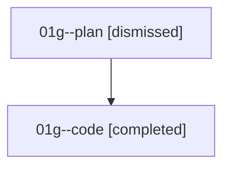

# Family: 01g

[Agent Hoods](../README.md) / [bbugyi200](../users/bbugyi200/README.md) / [athena](../users/bbugyi200/machines/athena/README.md) / [01g](../users/bbugyi200/machines/athena/hoods/01g/README.md) / 01g

Owner: `bbugyi200.athena` · Hood: `01g` · Members: 2

## Lineage

The diagram is an optional enhancement; the ordered table below contains the same lineage in accessible text.

| Role | Agent | State | Model / provider | Timing | Commits | Prompt | Chat |
|---|---|---|---|---|---:|---|---|
| plan | 01g--plan | dismissed | opus / claude | 2026-08-14T13:08:56.690049 → 2026-08-14T13:31:23.180855 | 0 | — | [Chat](../agents/bbugyi200.athena.01g--plan/chat.md) |
| code | 01g--code | completed | gpt-5.5 / codex | 2026-08-14T17:19:53.992942+00:00 | 0 | — | [Chat](../agents/bbugyi200.athena.01g--code/chat.md) |

## Commits

| Role | Repo | Commit | Subject | Committed |
|---|---|---|---|---|
| — | bob-cli | [`d2396d2`](https://github.com/bobs-org/bob-cli/commit/d2396d2d2e76ba7b58e10a6002756833cb1a767a) | chore: Add SDD prompt and plan for capture\_embedded\_bullet\_marker | 2026-06-19 18:17:51 UTC |
| — | bob-cli | [`0fca62e`](https://github.com/bobs-org/bob-cli/commit/0fca62ee3baf87a49f469d2c54cf227deb541836) | feat(capture): Require bullet markers on @route tokens | 2026-06-19 18:30:05 UTC |
