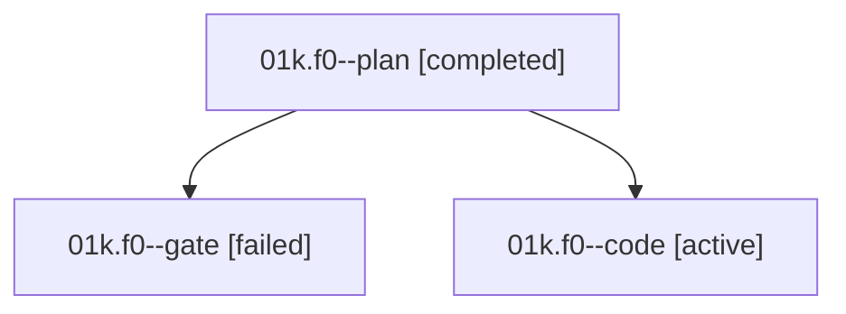

# Family: 01k.f0

[Agent Hoods](../README.md) / [bbugyi200](../users/bbugyi200/README.md) / [athena](../users/bbugyi200/machines/athena/README.md) / [01k](../users/bbugyi200/machines/athena/hoods/01k/README.md) / 01k.f0

Owner: `bbugyi200.athena` · Hood: `01k` · Members: 3

## Lineage

The diagram is an optional enhancement; the ordered table below contains the same lineage in accessible text.

| Role | Agent | State | Model / provider | Timing | Commits | Prompt | Chat |
|---|---|---|---|---|---:|---|---|
| plan | 01k.f0--plan | completed | gpt-5.6-sol / codex | 2026-09-07T14:29:29.280119+00:00 → 2026-09-07T14:39:06.580617+00:00 | 0 | [Prompt](../agents/bbugyi200.athena.01k.f0--plan/prompt.md) | [Chat](../agents/bbugyi200.athena.01k.f0--plan/chat.md) |
| gate | 01k.f0--gate | failed | gpt-5.6-sol / codex | 2026-09-07T14:38:56.537789+00:00 → 2026-09-07T14:40:47.242614+00:00 | 0 | — | [Chat](../agents/bbugyi200.athena.01k.f0--gate/chat.md) |
| code | 01k.f0--code | active | grok-4.6 / grok | 2026-09-07T14:40:54.573109+00:00 | 0 | [Prompt](../agents/bbugyi200.athena.01k.f0--code/prompt.md) | — |

## Neighbors

| Agent | Relation | State |
|---|---|---|
| [01k](bbugyi200.athena.01k.md) (family · 3) | ancestor | completed 2, failed 1 |
