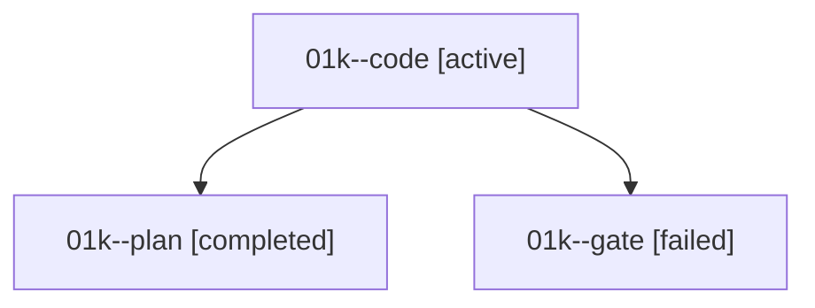

# Family: 01k

[Agent Hoods](../README.md) / [bbugyi200](../users/bbugyi200/README.md) / [athena](../users/bbugyi200/machines/athena/README.md) / [01k](../users/bbugyi200/machines/athena/hoods/01k/README.md) / 01k

Owner: `bbugyi200.athena` · Hood: `01k` · Members: 3

## Lineage

The diagram is an optional enhancement; the ordered table below contains the same lineage in accessible text.

| Role | Agent | State | Model / provider | Timing | Commits | Prompt | Chat |
|---|---|---|---|---|---:|---|---|
| code | 01k--code | active | grok-4.6 / grok | 2026-09-07T13:53:15.365873+00:00 | 0 | [Prompt](../agents/bbugyi200.athena.01k--code/prompt.md) | — |
| plan | 01k--plan | completed | gpt-5.6-sol / codex | 2026-09-07T13:39:45.793898+00:00 → 2026-09-07T13:52:22.820183+00:00 | 0 | [Prompt](../agents/bbugyi200.athena.01k--plan/prompt.md) | [Chat](../agents/bbugyi200.athena.01k--plan/chat.md) |
| gate | 01k--gate | failed | gpt-5.6-sol / codex | 2026-09-07T13:52:06.282990+00:00 → 2026-09-07T13:53:06.870626+00:00 | 0 | — | [Chat](../agents/bbugyi200.athena.01k--gate/chat.md) |
