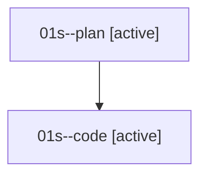

# Family: 01s

[Agent Hoods](../README.md) / [bbugyi200](../users/bbugyi200/README.md) / [athena](../users/bbugyi200/machines/athena/README.md) / [01s](../users/bbugyi200/machines/athena/hoods/01s/README.md) / 01s

Owner: `bbugyi200.athena` · Hood: `01s` · Members: 2

## Lineage

The diagram is an optional enhancement; the ordered table below contains the same lineage in accessible text.

| Role | Agent | State | Model / provider | Timing | Commits | Prompt | Chat |
|---|---|---|---|---|---:|---|---|
| plan | 01s--plan | active | gpt-5.6-sol / codex | 2026-08-14T19:35:47.682575+00:00 | 0 | [Prompt](../agents/bbugyi200.athena.01s--plan/prompt.md) | [Chat](../agents/bbugyi200.athena.01s--plan/chat.md) |
| code | 01s--code | active | grok-4.6 / grok | 2026-08-14T19:48:14.254622+00:00 | 0 | — | — |

## Commits

| Role | Repo | Commit | Subject | Committed |
|---|---|---|---|---|
| — | bob-cli | [`57d6b2c`](https://github.com/bobs-org/bob-cli/commit/57d6b2cea9d44f2e7bb701c9b906f88509c95da3) | chore: Add SDD prompt and plan for capture\_notification | 2026-06-19 21:35:18 EDT |
