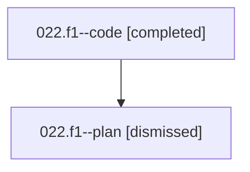

# Family: 022.f1

[Agent Hoods](../README.md) / [bbugyi200](../users/bbugyi200/README.md) / [athena](../users/bbugyi200/machines/athena/README.md) / [022](../users/bbugyi200/machines/athena/hoods/022/README.md) / 022.f1

Owner: `bbugyi200.athena` · Hood: `022` · Members: 2

## Lineage

The diagram is an optional enhancement; the ordered table below contains the same lineage in accessible text.

| Role | Agent | State | Model / provider | Timing | Commits | Prompt | Chat |
|---|---|---|---|---|---:|---|---|
| code | 022.f1--code | completed | grok-4.6 / grok | 2026-08-15T12:43:34.173006+00:00 | 0 | — | [Chat](../agents/bbugyi200.athena.022.f1--code/chat.md) |
| plan | 022.f1--plan | dismissed | gpt-5.6-sol / codex | 2026-08-15T08:39:04.996617 → 2026-08-15T09:07:59.126046 | 0 | — | [Chat](../agents/bbugyi200.athena.022.f1--plan/chat.md) |

## Neighbors

| Agent | Relation | State |
|---|---|---|
| [022](bbugyi200.athena.022.md) (family · 2) | ancestor | completed 1, dismissed 1 |
| [022.f0](bbugyi200.athena.022.f0.md) (family · 2) | 022 hood | completed 1, dismissed 1 |
| [022.f0.f0](bbugyi200.athena.022.f0.f0.md) (family · 2) | 022 hood | completed 1, dismissed 1 |
