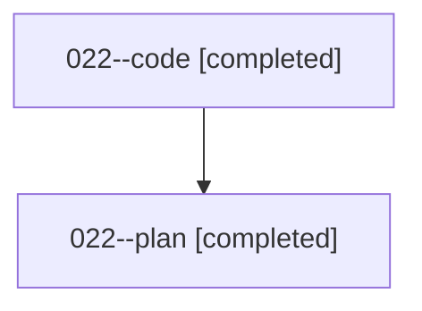

# Family: 022

[Agent Hoods](../README.md) / [bbugyi200](../users/bbugyi200/README.md) / [athena](../users/bbugyi200/machines/athena/README.md) / [022](../users/bbugyi200/machines/athena/hoods/022/README.md) / 022

Owner: `bbugyi200.athena` · Hood: `022` · Members: 2

## Lineage

The diagram is an optional enhancement; the ordered table below contains the same lineage in accessible text.

| Role | Agent | State | Model / provider | Timing | Commits | Prompt | Chat |
|---|---|---|---|---|---:|---|---|
| code | 022--code | completed | gpt-5.5 / codex | 2026-08-15T11:56:45.608606+00:00 | [1](../agents/bbugyi200.athena.022--code/README.md#commits) | — | [Chat](../agents/bbugyi200.athena.022--code/chat.md) |
| plan | 022--plan | completed | gpt-5.6-sol / codex | 2026-08-15T11:40:38.913776+00:00 | 0 | [Prompt](../agents/bbugyi200.athena.022--plan/prompt.md) | [Chat](../agents/bbugyi200.athena.022--plan/chat.md) |

## Commits

| Role | Repo | Commit | Subject | Committed |
|---|---|---|---|---|
| code | bob-cli | [`31b3461`](https://github.com/bobs-org/bob-cli/commit/31b346170befa08f998d4408665f99ae97c538b7) | feat(capture): add ID-only routed task marker | 2026-08-15 08:18:53 EDT |

## Neighbors

| Agent | Relation | State |
|---|---|---|
| [022.f0](bbugyi200.athena.022.f0.md) (family · 2) | descendant | completed 2 |
| [022.f0.f0](bbugyi200.athena.022.f0.f0.md) (family · 2) | descendant | active 2 |
| [022.f1](bbugyi200.athena.022.f1.md) (family · 2) | descendant | active 2 |
