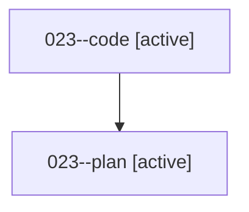

# Family: 023

[Agent Hoods](../README.md) / [bbugyi200](../users/bbugyi200/README.md) / [athena](../users/bbugyi200/machines/athena/README.md) / [023](../users/bbugyi200/machines/athena/hoods/023/README.md) / 023

Owner: `bbugyi200.athena` · Hood: `023` · Members: 2

## Lineage

The diagram is an optional enhancement; the ordered table below contains the same lineage in accessible text.

| Role | Agent | State | Model / provider | Timing | Commits | Prompt | Chat |
|---|---|---|---|---|---:|---|---|
| code | 023--code | active | sonnet / claude | 2026-08-15T12:35:07.691568+00:00 | 0 | — | — |
| plan | 023--plan | active | gpt-5.6-sol / codex | 2026-08-15T12:25:29.289564+00:00 | 0 | [Prompt](../agents/bbugyi200.athena.023--plan/prompt.md) | [Chat](../agents/bbugyi200.athena.023--plan/chat.md) |
