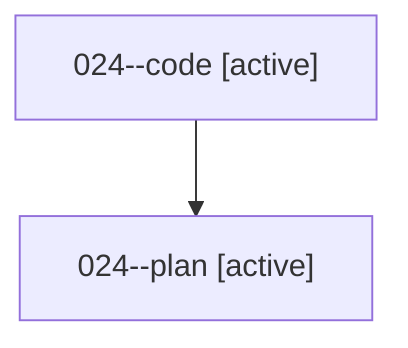

# Family: 024

[Agent Hoods](../README.md) / [bbugyi200](../users/bbugyi200/README.md) / [athena](../users/bbugyi200/machines/athena/README.md) / [024](../users/bbugyi200/machines/athena/hoods/024/README.md) / 024

Owner: `bbugyi200.athena` · Hood: `024` · Members: 2

## Lineage

The diagram is an optional enhancement; the ordered table below contains the same lineage in accessible text.

| Role | Agent | State | Model / provider | Timing | Commits | Prompt | Chat |
|---|---|---|---|---|---:|---|---|
| code | 024--code | active | gpt-5.5 / codex | 2026-08-15T13:18:35.754644+00:00 | 0 | — | — |
| plan | 024--plan | active | gpt-5.6-sol / codex | 2026-08-15T13:10:16.555612+00:00 | 0 | [Prompt](../agents/bbugyi200.athena.024--plan/prompt.md) | [Chat](../agents/bbugyi200.athena.024--plan/chat.md) |

## Neighbors

| Agent | Relation | State |
|---|---|---|
| [024.w0](../agents/bbugyi200.athena.024.w0/README.md) | descendant | waiting |
