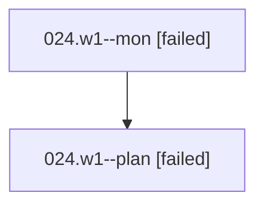

# Family: 024.w1

[Agent Hoods](../README.md) / [bbugyi200](../users/bbugyi200/README.md) / [athena](../users/bbugyi200/machines/athena/README.md) / [024](../users/bbugyi200/machines/athena/hoods/024/README.md) / 024.w1

Owner: `bbugyi200.athena` · Hood: `024` · Members: 2

## Lineage

The diagram is an optional enhancement; the ordered table below contains the same lineage in accessible text.

| Role | Agent | State | Model / provider | Timing | Commits | Prompt | Chat |
|---|---|---|---|---|---:|---|---|
| mon | 024.w1--mon | failed | gpt-5.6-sol / codex | 2026-08-15T13:47:45.189637+00:00 | 0 | — | [Chat](../agents/bbugyi200.athena.024.w1--mon/chat.md) |
| plan | 024.w1--plan | failed | gpt-5.6-sol / codex | 2026-08-15T13:40:17.976515+00:00 | 0 | [Prompt](../agents/bbugyi200.athena.024.w1--plan/prompt.md) | [Chat](../agents/bbugyi200.athena.024.w1--plan/chat.md) |

## Neighbors

| Agent | Relation | State |
|---|---|---|
| [024](bbugyi200.athena.024.md) (family · 2) | ancestor | completed 2 |
