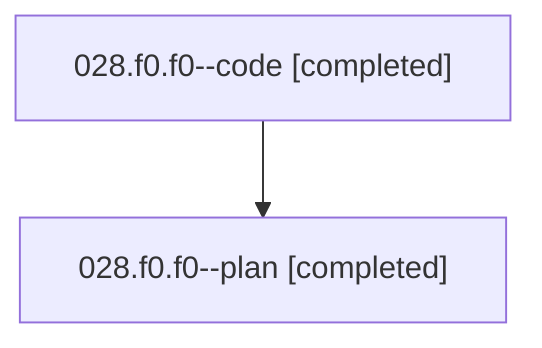

# Family: 028.f0.f0

[Agent Hoods](../README.md) / [bbugyi200](../users/bbugyi200/README.md) / [athena](../users/bbugyi200/machines/athena/README.md) / [028](../users/bbugyi200/machines/athena/hoods/028/README.md) / 028.f0.f0

Owner: `bbugyi200.athena` · Hood: `028` · Members: 2

## Lineage

The diagram is an optional enhancement; the ordered table below contains the same lineage in accessible text.

| Role | Agent | State | Model / provider | Timing | Commits | Prompt | Chat |
|---|---|---|---|---|---:|---|---|
| code | 028.f0.f0--code | completed | gpt-5.5 / codex | 2026-08-15T15:01:34.050236+00:00 | 0 | — | [Chat](../agents/bbugyi200.athena.028.f0.f0--code/chat.md) |
| plan | 028.f0.f0--plan | completed | gpt-5.6-sol / codex | 2026-08-15T14:46:08.266051+00:00 | 0 | [Prompt](../agents/bbugyi200.athena.028.f0.f0--plan/prompt.md) | [Chat](../agents/bbugyi200.athena.028.f0.f0--plan/chat.md) |

## Neighbors

| Agent | Relation | State |
|---|---|---|
| [028.f0](bbugyi200.athena.028.f0.md) (family · 2) | ancestor | completed 2 |
| [028](../agents/bbugyi200.athena.028/README.md) | ancestor | completed |
| [028.f0.f0.f1](bbugyi200.athena.028.f0.f0.f1.md) (family · 2) | descendant | active 2 |
