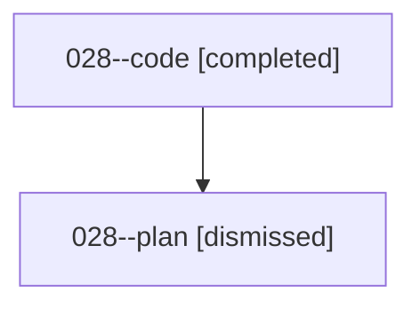

# Family: 028

[Agent Hoods](../README.md) / [bbugyi200](../users/bbugyi200/README.md) / [athena](../users/bbugyi200/machines/athena/README.md) / [028](../users/bbugyi200/machines/athena/hoods/028/README.md) / 028

Owner: `bbugyi200.athena` · Hood: `028` · Members: 2

## Lineage

The diagram is an optional enhancement; the ordered table below contains the same lineage in accessible text.

| Role | Agent | State | Model / provider | Timing | Commits | Prompt | Chat |
|---|---|---|---|---|---:|---|---|
| code | 028--code | completed | sonnet / claude | 2026-08-15T13:52:25.020579+00:00 | 0 | — | [Chat](../agents/bbugyi200.athena.028--code/chat.md) |
| plan | 028--plan | dismissed | — | 2026-08-15T09:43:22 | 0 | — | — |

## Commits

| Role | Repo | Commit | Subject | Committed |
|---|---|---|---|---|
| — | bob-cli | [`ca11be1`](https://github.com/bobs-org/bob-cli/commit/ca11be13498d7e34ec8110bb4ffd82a409f529ab) | chore: Add SDD prompt and plan for update\_github\_org\_refs | 2026-06-20 12:48:56 EDT |
| — | bob-cli | [`291bf31`](https://github.com/bobs-org/bob-cli/commit/291bf3181077f54d037cdbff282418cdcbed8bf3) | chore: update GitHub owner refs from bbugyi200 to bobs-org | 2026-06-20 12:55:55 EDT |

## Neighbors

| Agent | Relation | State |
|---|---|---|
| [028.f0](bbugyi200.athena.028.f0.md) (family · 2) | descendant | completed 1, dismissed 1 |
| [028.f0.f0](bbugyi200.athena.028.f0.f0.md) (family · 2) | descendant | completed 1, dismissed 1 |
| [028.f0.f0.f1](bbugyi200.athena.028.f0.f0.f1.md) (family · 2) | descendant | completed 1, dismissed 1 |
