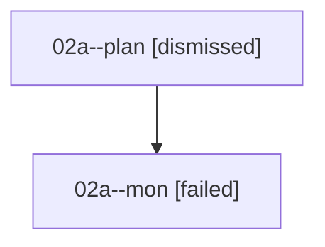

# Family: 02a

[Agent Hoods](../README.md) / [bbugyi200](../users/bbugyi200/README.md) / [athena](../users/bbugyi200/machines/athena/README.md) / [02a](../users/bbugyi200/machines/athena/hoods/02a/README.md) / 02a

Owner: `bbugyi200.athena` · Hood: `02a` · Members: 2

## Lineage

The diagram is an optional enhancement; the ordered table below contains the same lineage in accessible text.

| Role | Agent | State | Model / provider | Timing | Commits | Prompt | Chat |
|---|---|---|---|---|---:|---|---|
| plan | 02a--plan | dismissed | — | 2026-08-15T10:03:53 | 0 | — | — |
| mon | 02a--mon | failed | gpt-5.6-sol / codex | 2026-08-15T14:10:28.997139+00:00 | 0 | — | [Chat](../agents/bbugyi200.athena.02a--mon/chat.md) |

## Commits

| Role | Repo | Commit | Subject | Committed |
|---|---|---|---|---|
| — | bob-cli | [`a20bf38`](https://github.com/bobs-org/bob-cli/commit/a20bf38a1e0dab746dec748c0bdba82d146ee1be) | chore: Add SDD prompt and plan for vim\_surround\_fixes | 2026-06-20 13:02:55 EDT |
