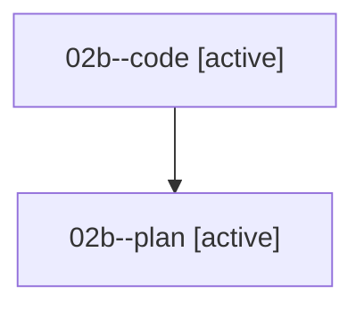

# Family: 02b

[Agent Hoods](../README.md) / [bbugyi200](../users/bbugyi200/README.md) / [athena](../users/bbugyi200/machines/athena/README.md) / [02b](../users/bbugyi200/machines/athena/hoods/02b/README.md) / 02b

Owner: `bbugyi200.athena` · Hood: `02b` · Members: 2

## Lineage

The diagram is an optional enhancement; the ordered table below contains the same lineage in accessible text.

| Role | Agent | State | Model / provider | Timing | Commits | Prompt | Chat |
|---|---|---|---|---|---:|---|---|
| code | 02b--code | active | sonnet / claude | 2026-08-15T14:33:33.899131+00:00 | 0 | — | — |
| plan | 02b--plan | active | gpt-5.6-sol / codex | 2026-08-15T14:22:20.011275+00:00 | 0 | [Prompt](../agents/bbugyi200.athena.02b--plan/prompt.md) | [Chat](../agents/bbugyi200.athena.02b--plan/chat.md) |
