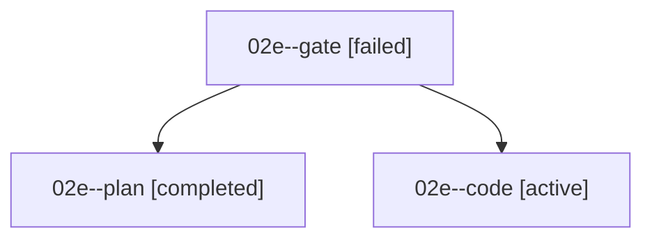

# Family: 02e

[Agent Hoods](../README.md) / [bbugyi200](../users/bbugyi200/README.md) / [athena](../users/bbugyi200/machines/athena/README.md) / [02e](../users/bbugyi200/machines/athena/hoods/02e/README.md) / 02e

Owner: `bbugyi200.athena` · Hood: `02e` · Members: 3

## Lineage

The diagram is an optional enhancement; the ordered table below contains the same lineage in accessible text.

| Role | Agent | State | Model / provider | Timing | Commits | Prompt | Chat |
|---|---|---|---|---|---:|---|---|
| gate | 02e--gate | failed | gpt-5.6-sol / codex | 2026-09-07T15:11:43.772083+00:00 → 2026-09-07T15:13:21.663817+00:00 | 0 | — | [Chat](../agents/bbugyi200.athena.02e--gate/chat.md) |
| plan | 02e--plan | completed | gpt-5.6-sol / codex | 2026-09-07T15:00:18.667036+00:00 → 2026-09-07T15:11:52.096391+00:00 | 0 | [Prompt](../agents/bbugyi200.athena.02e--plan/prompt.md) | [Chat](../agents/bbugyi200.athena.02e--plan/chat.md) |
| code | 02e--code | active | gpt-5.5 / codex | 2026-09-07T15:13:30.496405+00:00 | 0 | [Prompt](../agents/bbugyi200.athena.02e--code/prompt.md) | — |
