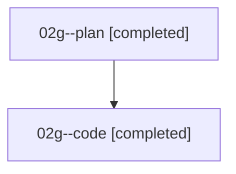

# Family: 02g

[Agent Hoods](../README.md) / [bbugyi200](../users/bbugyi200/README.md) / [athena](../users/bbugyi200/machines/athena/README.md) / [02g](../users/bbugyi200/machines/athena/hoods/02g/README.md) / 02g

Owner: `bbugyi200.athena` · Hood: `02g` · Members: 2

## Lineage

The diagram is an optional enhancement; the ordered table below contains the same lineage in accessible text.

| Role | Agent | State | Model / provider | Timing | Commits | Prompt | Chat |
|---|---|---|---|---|---:|---|---|
| plan | 02g--plan | completed | gpt-5.6-sol / codex | 2026-08-15T15:14:57.008771+00:00 | 0 | [Prompt](../agents/bbugyi200.athena.02g--plan/prompt.md) | [Chat](../agents/bbugyi200.athena.02g--plan/chat.md) |
| code | 02g--code | completed | gpt-5.5 / codex | 2026-08-15T15:20:12.679673+00:00 | 0 | — | [Chat](../agents/bbugyi200.athena.02g--code/chat.md) |

## Neighbors

| Agent | Relation | State |
|---|---|---|
| [02g.f0](bbugyi200.athena.02g.f0.md) (family · 2) | descendant | completed 2 |
| [02g.f0.f0](bbugyi200.athena.02g.f0.f0.md) (family · 2) | descendant | active 2 |
