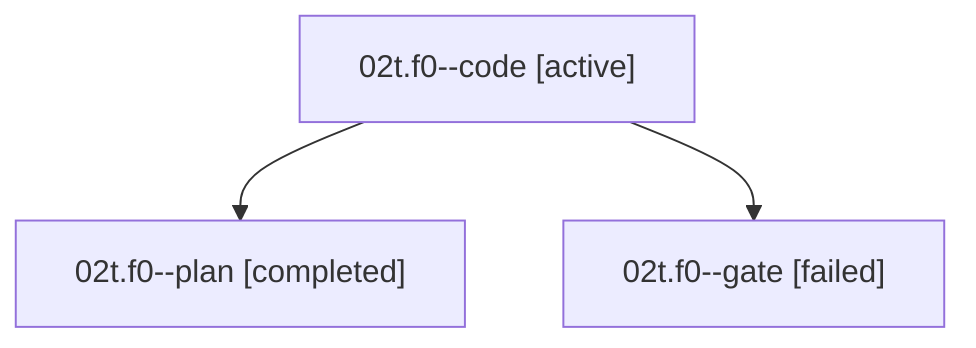

# Family: 02t.f0

[Agent Hoods](../README.md) / [bbugyi200](../users/bbugyi200/README.md) / [athena](../users/bbugyi200/machines/athena/README.md) / [02t](../users/bbugyi200/machines/athena/hoods/02t/README.md) / 02t.f0

Owner: `bbugyi200.athena` · Hood: `02t` · Members: 3

## Lineage

The diagram is an optional enhancement; the ordered table below contains the same lineage in accessible text.

| Role | Agent | State | Model / provider | Timing | Commits | Prompt | Chat |
|---|---|---|---|---|---:|---|---|
| code | 02t.f0--code | active | grok-4.6 / grok | 2026-09-07T18:54:37.965001+00:00 | 0 | [Prompt](../agents/bbugyi200.athena.02t.f0--code/prompt.md) | — |
| plan | 02t.f0--plan | completed | gpt-5.6-sol / codex | 2026-09-07T18:44:47.185140+00:00 → 2026-09-07T18:53:22.342123+00:00 | 0 | [Prompt](../agents/bbugyi200.athena.02t.f0--plan/prompt.md) | [Chat](../agents/bbugyi200.athena.02t.f0--plan/chat.md) |
| gate | 02t.f0--gate | failed | gpt-5.6-sol / codex | 2026-09-07T18:52:23.297869+00:00 → 2026-09-07T18:54:28.585330+00:00 | 0 | — | [Chat](../agents/bbugyi200.athena.02t.f0--gate/chat.md) |

## Neighbors

| Agent | Relation | State |
|---|---|---|
| [02t](bbugyi200.athena.02t.md) (family · 3) | ancestor | completed 2, failed 1 |
