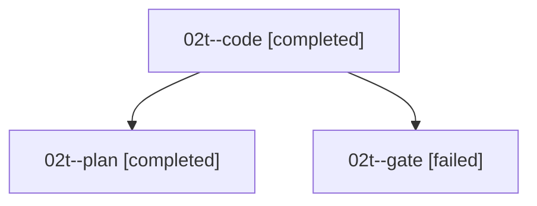

# Family: 02t

[Agent Hoods](../README.md) / [bbugyi200](../users/bbugyi200/README.md) / [athena](../users/bbugyi200/machines/athena/README.md) / [02t](../users/bbugyi200/machines/athena/hoods/02t/README.md) / 02t

Owner: `bbugyi200.athena` · Hood: `02t` · Members: 3

## Lineage

The diagram is an optional enhancement; the ordered table below contains the same lineage in accessible text.

| Role | Agent | State | Model / provider | Timing | Commits | Prompt | Chat |
|---|---|---|---|---|---:|---|---|
| code | 02t--code | completed | sonnet / claude | 2026-09-07T14:40:19.071872+00:00 → 2026-09-07T14:49:23.017724+00:00 | 0 | [Prompt](../agents/bbugyi200.athena.02t--code/prompt.md) | [Chat](../agents/bbugyi200.athena.02t--code/chat.md) |
| plan | 02t--plan | completed | opus / claude | 2026-09-07T14:25:08.667982+00:00 → 2026-09-07T14:39:05.939015+00:00 | 0 | [Prompt](../agents/bbugyi200.athena.02t--plan/prompt.md) | [Chat](../agents/bbugyi200.athena.02t--plan/chat.md) |
| gate | 02t--gate | failed | opus / claude | 2026-09-07T14:38:35.310534+00:00 → 2026-09-07T14:40:11.839013+00:00 | 0 | — | [Chat](../agents/bbugyi200.athena.02t--gate/chat.md) |

## Neighbors

| Agent | Relation | State |
|---|---|---|
| [02t.f0](bbugyi200.athena.02t.f0.md) (family · 3) | descendant | active 1, completed 1, failed 1 |
