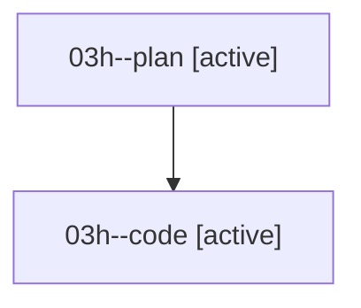

# Family: 03h

[Agent Hoods](../README.md) / [bbugyi200](../users/bbugyi200/README.md) / [athena](../users/bbugyi200/machines/athena/README.md) / [03h](../users/bbugyi200/machines/athena/hoods/03h/README.md) / 03h

Owner: `bbugyi200.athena` · Hood: `03h` · Members: 2

## Lineage

The diagram is an optional enhancement; the ordered table below contains the same lineage in accessible text.

| Role | Agent | State | Model / provider | Timing | Commits | Prompt | Chat |
|---|---|---|---|---|---:|---|---|
| plan | 03h--plan | active | gpt-5.6-sol / codex | 2026-08-16T13:51:13.739519+00:00 | 0 | [Prompt](../agents/bbugyi200.athena.03h--plan/prompt.md) | [Chat](../agents/bbugyi200.athena.03h--plan/chat.md) |
| code | 03h--code | active | gemini-3.7-flash-high / agy | 2026-08-16T13:56:08.490798+00:00 | 0 | — | — |

## Neighbors

| Agent | Relation | State |
|---|---|---|
| [03h.cld](../agents/bbugyi200.athena.03h.cld/README.md) | descendant | completed |
