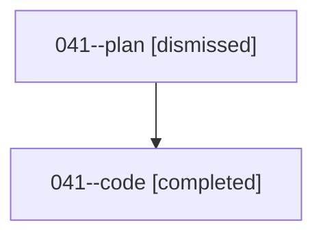

# Family: 041

[Agent Hoods](../README.md) / [bbugyi200](../users/bbugyi200/README.md) / [athena](../users/bbugyi200/machines/athena/README.md) / [041](../users/bbugyi200/machines/athena/hoods/041/README.md) / 041

Owner: `bbugyi200.athena` · Hood: `041` · Members: 2

## Lineage

The diagram is an optional enhancement; the ordered table below contains the same lineage in accessible text.

| Role | Agent | State | Model / provider | Timing | Commits | Prompt | Chat |
|---|---|---|---|---|---:|---|---|
| plan | 041--plan | dismissed | — | 2026-08-16T13:20:31 | 0 | — | — |
| code | 041--code | completed | grok-4.6 / grok | 2026-08-16T17:29:52.978983+00:00 | [1](../agents/bbugyi200.athena.041--code/README.md#commits) | — | [Chat](../agents/bbugyi200.athena.041--code/chat.md) |

## Commits

| Role | Repo | Commit | Subject | Committed |
|---|---|---|---|---|
| code | bob-cli | [`adabd23`](https://github.com/bobs-org/bob-cli/commit/adabd23792d3d296c82fd66ff298c16a6003f063) | feat(capture): insert sub-bullet captures before managed logs | 2026-08-16 13:40:52 EDT |
