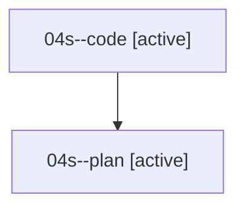

# Family: 04s

[Agent Hoods](../README.md) / [bbugyi200](../users/bbugyi200/README.md) / [athena](../users/bbugyi200/machines/athena/README.md) / [04s](../users/bbugyi200/machines/athena/hoods/04s/README.md) / 04s

Owner: `bbugyi200.athena` · Hood: `04s` · Members: 2

## Lineage

The diagram is an optional enhancement; the ordered table below contains the same lineage in accessible text.

| Role | Agent | State | Model / provider | Timing | Commits | Prompt | Chat |
|---|---|---|---|---|---:|---|---|
| code | 04s--code | active | grok-4.6 / grok | 2026-08-17T14:39:08.150219+00:00 | [1](../agents/bbugyi200.athena.04s--code/README.md#commits) | — | — |
| plan | 04s--plan | active | opus / claude | 2026-08-17T14:21:26.567815+00:00 | 0 | [Prompt](../agents/bbugyi200.athena.04s--plan/prompt.md) | [Chat](../agents/bbugyi200.athena.04s--plan/chat.md) |

## Commits

| Role | Repo | Commit | Subject | Committed |
|---|---|---|---|---|
| code | bob-cli | [`5e29ff8`](https://github.com/bobs-org/bob-cli/commit/5e29ff8ef1d3670a620497f42ace7eb3ec07d04c) | docs: document project-note-to-task reverse conversion | 2026-08-17 10:58:37 EDT |
