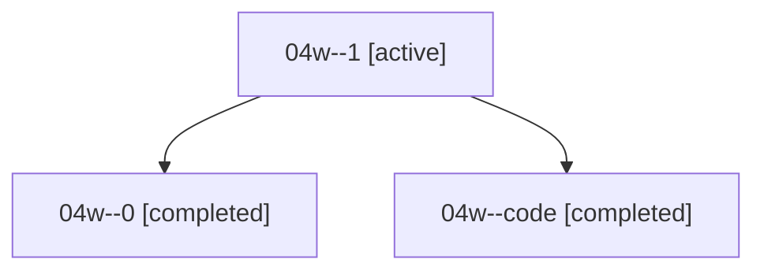

# Family: 04w

[Agent Hoods](../README.md) / [bbugyi200](../users/bbugyi200/README.md) / [athena](../users/bbugyi200/machines/athena/README.md) / [04w](../users/bbugyi200/machines/athena/hoods/04w/README.md) / 04w

Owner: `bbugyi200.athena` · Hood: `04w` · Members: 3

## Lineage

The diagram is an optional enhancement; the ordered table below contains the same lineage in accessible text.

| Role | Agent | State | Model / provider | Timing | Commits | Prompt | Chat |
|---|---|---|---|---|---:|---|---|
| 1 | 04w--1 | active | opus / claude | 2026-08-17T15:01:26.493402+00:00 | 0 | — | [Chat](../agents/bbugyi200.athena.04w--1/chat.md) |
| 0 | 04w--0 | completed | opus / claude | 2026-08-17T14:49:51.826454+00:00 | 0 | [Prompt](../agents/bbugyi200.athena.04w--0/prompt.md) | [Chat](../agents/bbugyi200.athena.04w--0/chat.md) |
| code | 04w--code | completed | sonnet / claude | 2026-08-17T15:16:15.072292+00:00 | [1](../agents/bbugyi200.athena.04w--code/README.md#commits) | — | [Chat](../agents/bbugyi200.athena.04w--code/chat.md) |

## Commits

| Role | Repo | Commit | Subject | Committed |
|---|---|---|---|---|
| code | bob-cli | [`85351cc`](https://github.com/bobs-org/bob-cli/commit/85351cce291e040ad8e918cab09f39b997e929ad) | docs: note option-bracket Blocked-cycle retirement in task-status-hooks | 2026-08-17 11:41:19 EDT |
