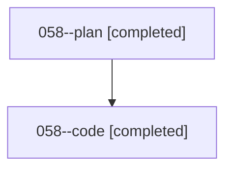

# Family: 058

[Agent Hoods](../README.md) / [bbugyi200](../users/bbugyi200/README.md) / [athena](../users/bbugyi200/machines/athena/README.md) / [058](../users/bbugyi200/machines/athena/hoods/058/README.md) / 058

Owner: `bbugyi200.athena` · Hood: `058` · Members: 2

## Lineage

The diagram is an optional enhancement; the ordered table below contains the same lineage in accessible text.

| Role | Agent | State | Model / provider | Timing | Commits | Prompt | Chat |
|---|---|---|---|---|---:|---|---|
| plan | 058--plan | completed | opus / claude | 2026-08-17T21:39:30.551218+00:00 | 0 | [Prompt](../agents/bbugyi200.athena.058--plan/prompt.md) | [Chat](../agents/bbugyi200.athena.058--plan/chat.md) |
| code | 058--code | completed | grok-4.6 / grok | 2026-08-17T21:49:20.653687+00:00 | 0 | — | [Chat](../agents/bbugyi200.athena.058--code/chat.md) |

## Commits

| Role | Repo | Commit | Subject | Committed |
|---|---|---|---|---|
| — | bob-cli | [`7d7b097`](https://github.com/bobs-org/bob-cli/commit/7d7b0978ae9187df767cfd9b60edaa411cae0821) | chore: Add SDD prompt and plan for block\_link\_task\_picker | 2026-06-24 07:53:16 EDT |
| — | bob-cli | [`70fb447`](https://github.com/bobs-org/bob-cli/commit/70fb447b94353f9e1dc623e4b4d380b66eb808b2) | chore: Mark SDD plan done | 2026-06-24 08:58:41 EDT |

## Neighbors

| Agent | Relation | State |
|---|---|---|
| [058.f1](../agents/bbugyi200.athena.058.f1/README.md) | descendant | completed |
