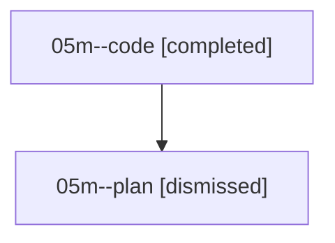

# Family: 05m

[Agent Hoods](../README.md) / [bbugyi200](../users/bbugyi200/README.md) / [athena](../users/bbugyi200/machines/athena/README.md) / [05m](../users/bbugyi200/machines/athena/hoods/05m/README.md) / 05m

Owner: `bbugyi200.athena` · Hood: `05m` · Members: 2

## Lineage

The diagram is an optional enhancement; the ordered table below contains the same lineage in accessible text.

| Role | Agent | State | Model / provider | Timing | Commits | Prompt | Chat |
|---|---|---|---|---|---:|---|---|
| code | 05m--code | completed | sonnet / claude | 2026-08-18T10:41:36.412007+00:00 | [1](../agents/bbugyi200.athena.05m--code/README.md#commits) | — | [Chat](../agents/bbugyi200.athena.05m--code/chat.md) |
| plan | 05m--plan | dismissed | — | 2026-08-18T06:32:57 | 0 | — | — |

## Commits

| Role | Repo | Commit | Subject | Committed |
|---|---|---|---|---|
| code | bob-cli | [`f171a7e`](https://github.com/bobs-org/bob-cli/commit/f171a7e02b12b6ac6aefcf078d1669798bb0e6a1) | feat(capture): add bare \`#\` Pomodoro-note marker | 2026-08-18 07:05:48 EDT |
