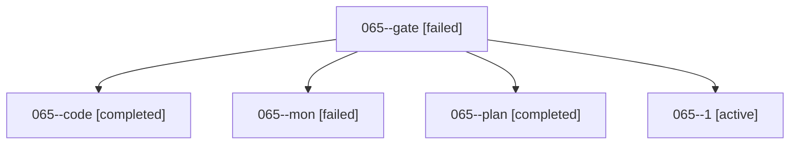

# Family: 065

[Agent Hoods](../README.md) / [bbugyi200](../users/bbugyi200/README.md) / [athena](../users/bbugyi200/machines/athena/README.md) / [065](../users/bbugyi200/machines/athena/hoods/065/README.md) / 065

Owner: `bbugyi200.athena` · Hood: `065` · Members: 5

## Lineage

The diagram is an optional enhancement; the ordered table below contains the same lineage in accessible text.

| Role | Agent | State | Model / provider | Timing | Commits | Prompt | Chat |
|---|---|---|---|---|---:|---|---|
| gate | 065--gate | failed | opus / claude | 2026-09-07T21:13:36.160520+00:00 → 2026-09-07T21:21:31.545585+00:00 | 0 | — | [Chat](../agents/bbugyi200.athena.065--gate/chat.md) |
| code | 065--code | completed | grok-4.6 / grok | 2026-09-07T21:21:38.995693+00:00 → 2026-09-07T21:27:14.317993+00:00 | 0 | [Prompt](../agents/bbugyi200.athena.065--code/prompt.md) | [Chat](../agents/bbugyi200.athena.065--code/chat.md) |
| mon | 065--mon | failed | grok-4.6 / grok | 2026-09-07T21:26:34.058071+00:00 → 2026-09-07T21:28:49.293754+00:00 | 0 | — | [Chat](../agents/bbugyi200.athena.065--mon/chat.md) |
| plan | 065--plan | completed | opus / claude | 2026-09-07T21:06:49.235168+00:00 → 2026-09-07T21:13:45.785782+00:00 | 0 | [Prompt](../agents/bbugyi200.athena.065--plan/prompt.md) | [Chat](../agents/bbugyi200.athena.065--plan/chat.md) |
| 1 | 065--1 | active | grok-4.6 / grok | 2026-09-07T21:29:07.908808+00:00 | 0 | [Prompt](../agents/bbugyi200.athena.065--1/prompt.md) | — |
