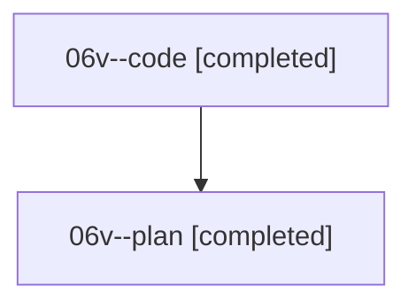

# Family: 06v

[Agent Hoods](../README.md) / [bbugyi200](../users/bbugyi200/README.md) / [athena](../users/bbugyi200/machines/athena/README.md) / [06v](../users/bbugyi200/machines/athena/hoods/06v/README.md) / 06v

Owner: `bbugyi200.athena` · Hood: `06v` · Members: 2

## Lineage

The diagram is an optional enhancement; the ordered table below contains the same lineage in accessible text.

| Role | Agent | State | Model / provider | Timing | Commits | Prompt | Chat |
|---|---|---|---|---|---:|---|---|
| code | 06v--code | completed | grok-4.6 / grok | 2026-08-18T22:00:35.448044+00:00 | [1](../agents/bbugyi200.athena.06v--code/README.md#commits) | — | [Chat](../agents/bbugyi200.athena.06v--code/chat.md) |
| plan | 06v--plan | completed | opus / claude | 2026-08-18T21:50:22.165542+00:00 | 0 | [Prompt](../agents/bbugyi200.athena.06v--plan/prompt.md) | [Chat](../agents/bbugyi200.athena.06v--plan/chat.md) |

## Commits

| Role | Repo | Commit | Subject | Committed |
|---|---|---|---|---|
| code | bob-cli | [`8ab074f`](https://github.com/bobs-org/bob-cli/commit/8ab074ff9b063d422be119670be1c96e4e445fbd) | feat(capture): attach bare # notes to last completed Pomodoro | 2026-08-18 22:06:27 UTC |
