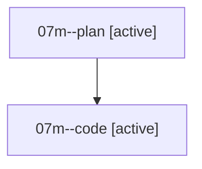

# Family: 07m

[Agent Hoods](../README.md) / [bbugyi200](../users/bbugyi200/README.md) / [athena](../users/bbugyi200/machines/athena/README.md) / [07m](../users/bbugyi200/machines/athena/hoods/07m/README.md) / 07m

Owner: `bbugyi200.athena` · Hood: `07m` · Members: 2

## Lineage

The diagram is an optional enhancement; the ordered table below contains the same lineage in accessible text.

| Role | Agent | State | Model / provider | Timing | Commits | Prompt | Chat |
|---|---|---|---|---|---:|---|---|
| plan | 07m--plan | active | opus / claude | 2026-08-19T13:09:59.076318+00:00 | 0 | [Prompt](../agents/bbugyi200.athena.07m--plan/prompt.md) | [Chat](../agents/bbugyi200.athena.07m--plan/chat.md) |
| code | 07m--code | active | grok-4.6 / grok | 2026-08-19T13:15:21.211999+00:00 | 0 | — | — |
