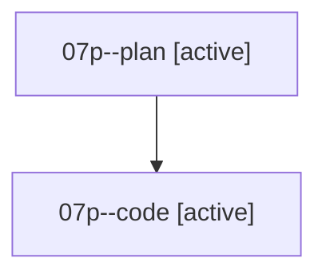

# Family: 07p

[Agent Hoods](../README.md) / [bbugyi200](../users/bbugyi200/README.md) / [athena](../users/bbugyi200/machines/athena/README.md) / [07p](../users/bbugyi200/machines/athena/hoods/07p/README.md) / 07p

Owner: `bbugyi200.athena` · Hood: `07p` · Members: 2

## Lineage

The diagram is an optional enhancement; the ordered table below contains the same lineage in accessible text.

| Role | Agent | State | Model / provider | Timing | Commits | Prompt | Chat |
|---|---|---|---|---|---:|---|---|
| plan | 07p--plan | active | opus / claude | 2026-08-19T13:39:26.645839+00:00 | 0 | [Prompt](../agents/bbugyi200.athena.07p--plan/prompt.md) | [Chat](../agents/bbugyi200.athena.07p--plan/chat.md) |
| code | 07p--code | active | grok-4.6 / grok | 2026-08-19T13:48:53.278845+00:00 | 0 | — | — |
