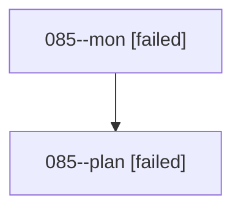

# Family: 085

[Agent Hoods](../README.md) / [bbugyi200](../users/bbugyi200/README.md) / [athena](../users/bbugyi200/machines/athena/README.md) / [085](../users/bbugyi200/machines/athena/hoods/085/README.md) / 085

Owner: `bbugyi200.athena` · Hood: `085` · Members: 2

## Lineage

The diagram is an optional enhancement; the ordered table below contains the same lineage in accessible text.

| Role | Agent | State | Model / provider | Timing | Commits | Prompt | Chat |
|---|---|---|---|---|---:|---|---|
| mon | 085--mon | failed | grok-4.6 / grok | 2026-08-19T20:04:33.330747+00:00 | 0 | — | [Chat](../agents/bbugyi200.athena.085--mon/chat.md) |
| plan | 085--plan | failed | grok-4.6 / grok | 2026-08-19T19:49:20.539444+00:00 | 0 | [Prompt](../agents/bbugyi200.athena.085--plan/prompt.md) | [Chat](../agents/bbugyi200.athena.085--plan/chat.md) |
