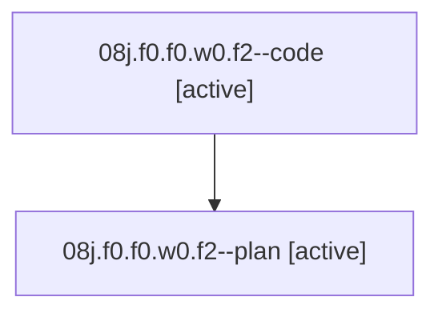

# Family: 08j.f0.f0.w0.f2

[Agent Hoods](../README.md) / [bbugyi200](../users/bbugyi200/README.md) / [athena](../users/bbugyi200/machines/athena/README.md) / [08j](../users/bbugyi200/machines/athena/hoods/08j/README.md) / 08j.f0.f0.w0.f2

Owner: `bbugyi200.athena` · Hood: `08j` · Members: 2

## Lineage

The diagram is an optional enhancement; the ordered table below contains the same lineage in accessible text.

| Role | Agent | State | Model / provider | Timing | Commits | Prompt | Chat |
|---|---|---|---|---|---:|---|---|
| code | 08j.f0.f0.w0.f2--code | active | grok-4.6 / grok | 2026-08-20T14:40:09.555844+00:00 | 0 | — | — |
| plan | 08j.f0.f0.w0.f2--plan | active | gpt-5.6-sol / codex | 2026-08-20T14:34:24.047040+00:00 | 0 | [Prompt](../agents/bbugyi200.athena.08j.f0.f0.w0.f2--plan/prompt.md) | [Chat](../agents/bbugyi200.athena.08j.f0.f0.w0.f2--plan/chat.md) |

## Neighbors

| Agent | Relation | State |
|---|---|---|
| [08j.f0.f0.w0](bbugyi200.athena.08j.f0.f0.w0.md) (family · 2) | ancestor | completed 2 |
| [08j.f0.f0](bbugyi200.athena.08j.f0.f0.md) (family · 2) | ancestor | completed 2 |
| [08j.f0](bbugyi200.athena.08j.f0.md) (family · 2) | ancestor | completed 2 |
| [08j](bbugyi200.athena.08j.md) (family · 2) | ancestor | completed 2 |
| [08j.f0.f0.w0.f0](../agents/bbugyi200.athena.08j.f0.f0.w0.f0/README.md) | 08j.f0.f0.w0 hood | dismissed |
