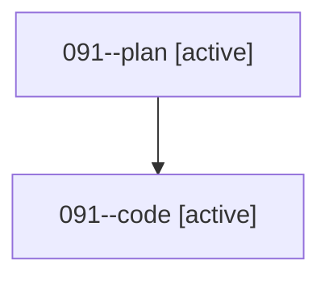

# Family: 091

[Agent Hoods](../README.md) / [bbugyi200](../users/bbugyi200/README.md) / [athena](../users/bbugyi200/machines/athena/README.md) / [091](../users/bbugyi200/machines/athena/hoods/091/README.md) / 091

Owner: `bbugyi200.athena` · Hood: `091` · Members: 2

## Lineage

The diagram is an optional enhancement; the ordered table below contains the same lineage in accessible text.

| Role | Agent | State | Model / provider | Timing | Commits | Prompt | Chat |
|---|---|---|---|---|---:|---|---|
| plan | 091--plan | active | gpt-5.6-sol / codex | 2026-08-21T10:40:19.290577+00:00 | 0 | [Prompt](../agents/bbugyi200.athena.091--plan/prompt.md) | [Chat](../agents/bbugyi200.athena.091--plan/chat.md) |
| code | 091--code | active | gpt-5.5 / codex | 2026-08-21T10:44:18.561366+00:00 | 0 | — | — |
